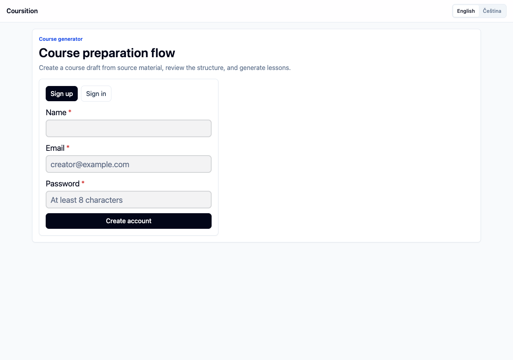
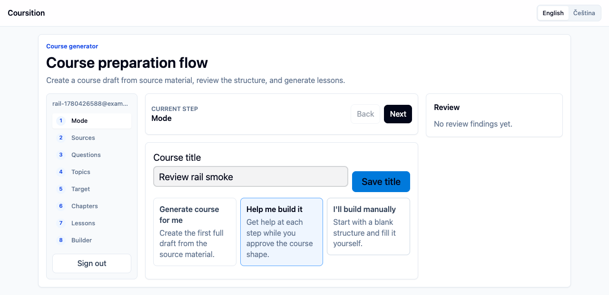
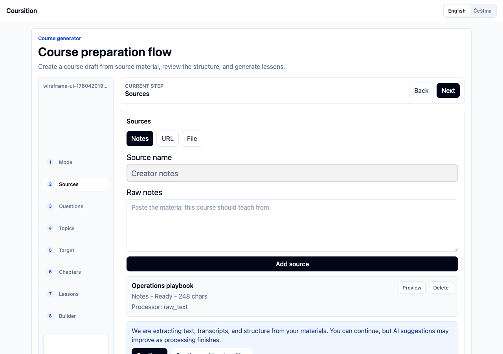
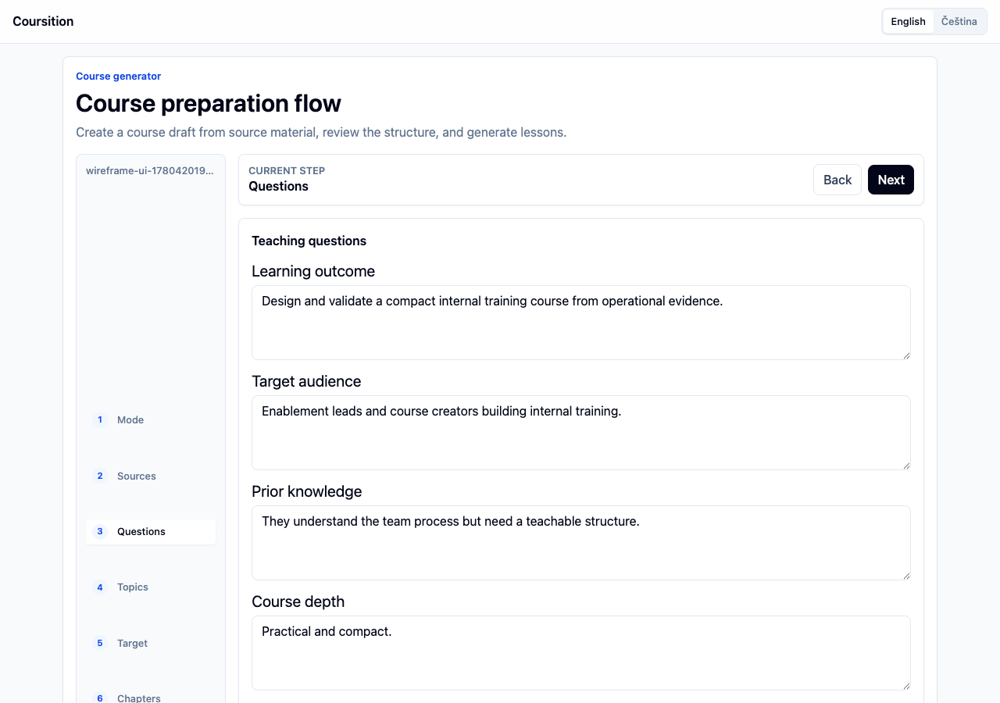
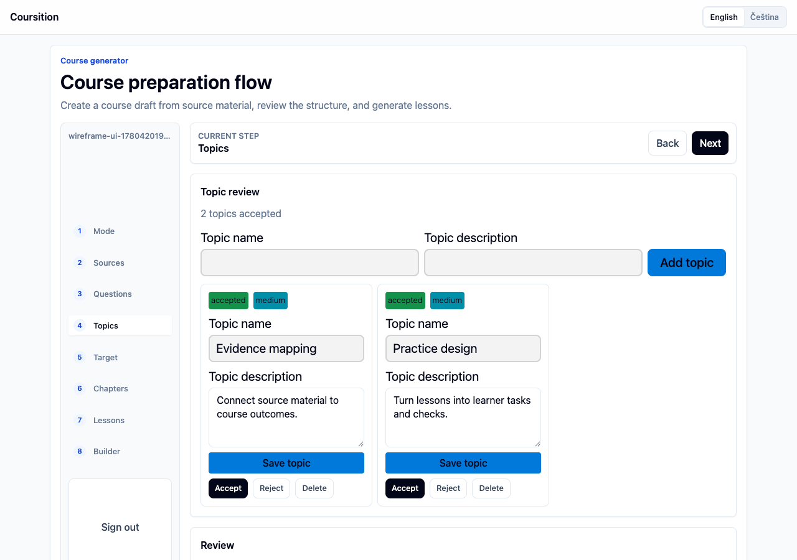
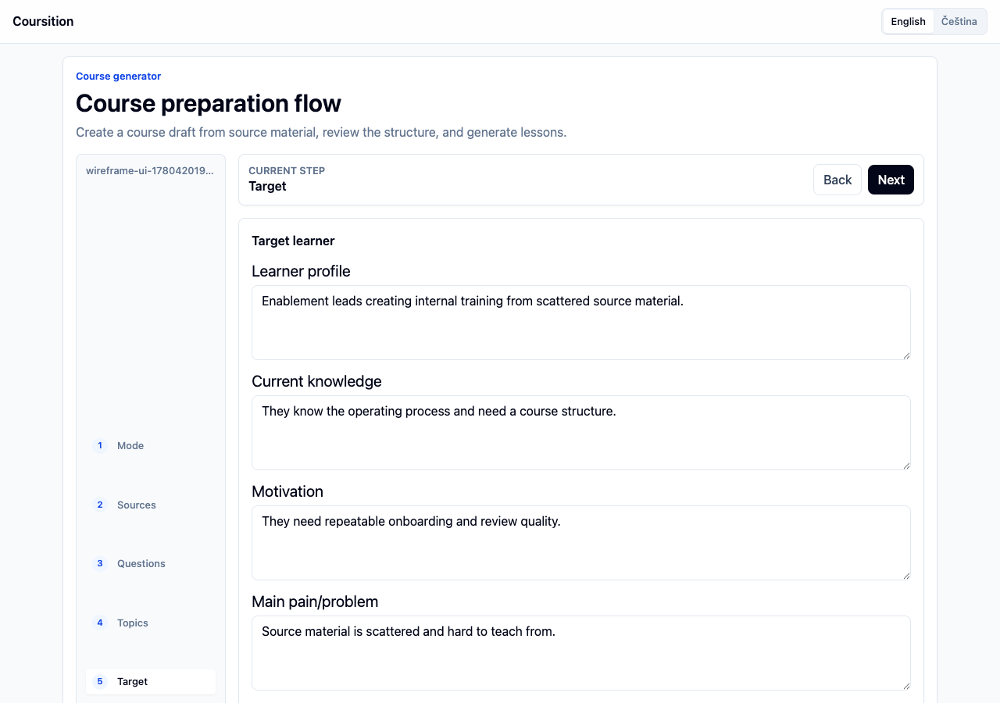
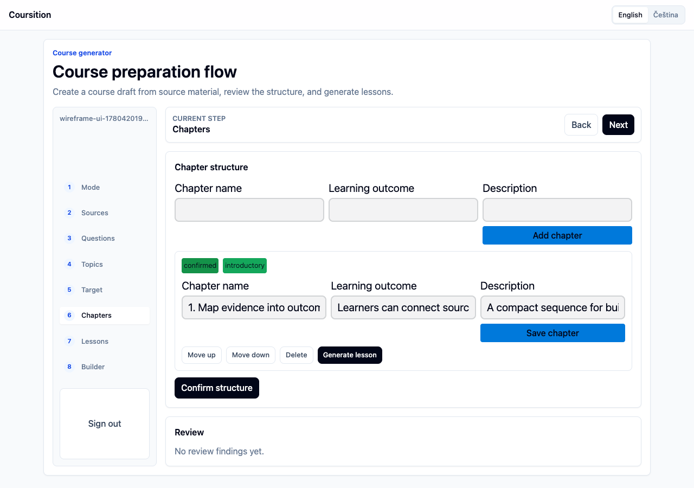
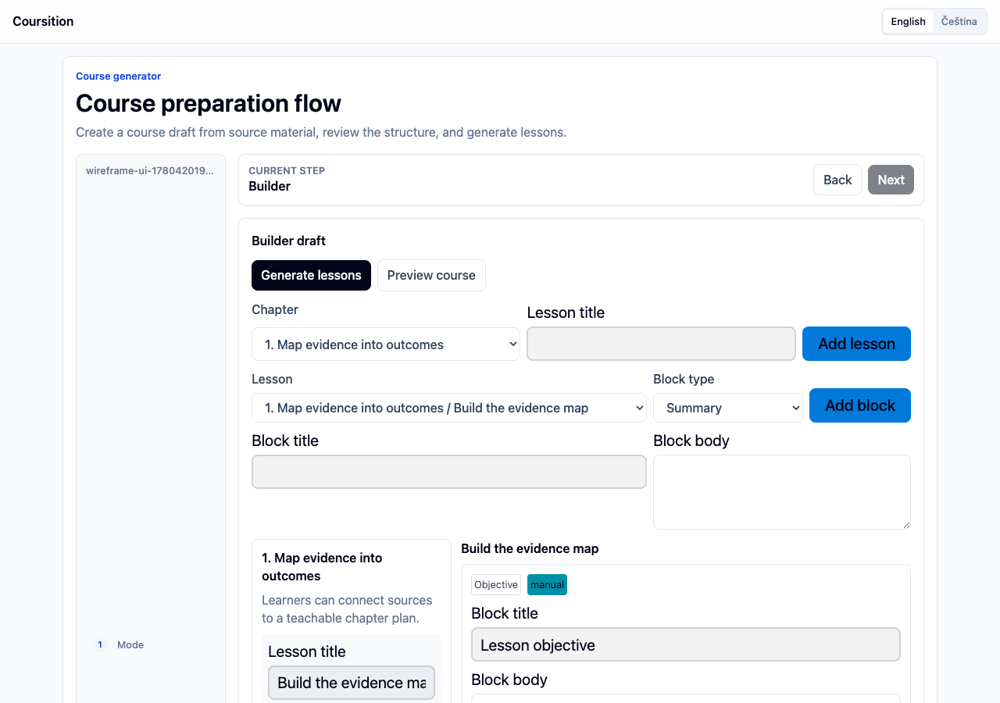

# PRD-001: AI Course Studio + Course Builder — Course Creation Vertical Slice

**Status:** ready-for-agent
**Primary surfaces:** AI Course Studio, Course Builder, optional internal course preview/player
**Primary user:** signed-in course creator
**Product boundary:** course creation only

This PRD follows the `to-prd` structure: synthesize the current context, use the agreed testing seams, then define the PRD through Problem Statement, Solution, User Stories, Implementation Decisions, Testing Decisions, Out of Scope, and Further Notes. ([GitHub][1])

Source basis: the existing Coursition materials position the company around a modular Course Builder/editor, secondary AI-assisted creation, composability, self-hosting as future differentiation, and educational companies/enterprises as early customers. The Lean Canvas frames Coursition as an advanced course-building editor that can integrate into existing systems, with AI-enhanced course creation, self-hosting, and seamless integration as key differentiators.

---

## Problem Statement

Course creators, education companies, and internal training teams often already have knowledge scattered across PDFs, slide decks, videos, documents, links, and rough notes. Turning that raw material into a structured, teachable course is slow because the creator has to extract the material, decide what matters, define the target learner, design the chapter structure, draft lessons, add practice, and then manually put everything into a course editor.

Existing course tools often help users host or manage courses, but they do not guide the creator through a high-quality teaching design process from source material to editable course draft. A generic AI chat box is not enough because it does not preserve source provenance, does not know the course structure, does not enforce teaching quality, and does not safely write into the Course Builder.

Coursition needs a focused course-creation vertical slice: ingest knowledge, guide the creator through key teaching questions, generate a structured course draft, let the creator review and edit it, and keep the output inside the platform.

---

## Solution

Build **AI Course Studio + Course Builder** as one connected course-creation flow.

The creator starts a new course draft, chooses how involved AI should be, uploads or links a knowledge base, answers guided teaching questions, reviews AI-proposed topics, confirms the target learner, edits the chapter structure, generates lesson drafts, and opens the result in Course Builder for final editing.

The first product slice must produce a **full editable course draft**, not only an outline.

The generated course draft should include:

```txt
Course brief
Target learner profile
Learning outcomes
Topic map
Chapter structure
Lesson drafts
Lesson blocks
Exercises / checks
AI review findings
Source-backed processing metadata
Editable Course Builder draft
```

No sales page, checkout, marketing copy, public academy site, custom domains, JSON import/export, or full learner management are included in this PRD.

---

## Product Principles

1. **Course creation first.**
   Everything in this PRD serves the creation of a structured, editable course draft.

2. **AI is workflow-native, not chatbox-native.**
   AI should be represented through durable runs, structured suggestions, reviewable findings, and safe application into the Course Builder.

3. **Teaching quality matters.**
   Generated lessons must include objective, explanation, practice/check, and summary. The product should not generate long passive content dumps.

4. **Sources remain visible to the system.**
   Uploaded/linked material must become source assets, derived documents, and knowledge chunks with provenance metadata.

5. **The creator stays in control.**
   AI can suggest, generate, critique, and draft. It should not silently overwrite accepted human work.

6. **Full yet minimal.**
   The result should feel like a real course-creation product, but stop before commerce, marketing, academy management, and broad LMS scope.

---

## Core Golden Path

```txt
Creator logs in
→ starts a new course draft
→ chooses AI involvement mode
→ uploads PDF, video, document, slides, image, or links
→ system processes knowledge base
→ creator continues or waits
→ creator answers guided teaching questions
→ AI suggests important topics
→ creator accepts / edits / rejects topics
→ AI helps define target learner
→ creator confirms target learner
→ AI proposes chapter structure
→ creator edits chapter structure
→ AI drafts lessons as Course Builder blocks
→ AI review panel surfaces issues
→ creator opens Course Builder
→ creator edits the draft
→ creator previews the course internally
```

---

# Detailed Product Requirements

## 1. Authentication and ownership

Coursition should require login for the course creation workflow because drafts, uploaded files, AI runs, and generated content need durable ownership.

Requirements:

- Use BetterAuth for login/session handling.
- A signed-in creator can create course drafts.
- A signed-in creator can return to unfinished wizard sessions.
- A signed-in creator can access their course drafts and source assets.
- Complex roles, teams, organizations, and enterprise permission systems are not part of this PRD.

---

## 2. Course Draft

A Course Draft is the editable working container created before AI or uploads begin.

A Course Draft should store:

```txt
working title
course language
AI involvement mode
wizard state
knowledge base references
accepted topics
target learner profile
chapter structure
lesson drafts
Course Builder content
AI review state
last saved state
```

The draft must exist before uploads start so that source assets, AI runs, and wizard progress have a stable parent.

---

## 3. AI involvement mode

The first wizard decision is how much AI should help.

The UI in the attached screenshots is directionally correct, but the product copy should be tightened.

Recommended labels:

| Mode               | UI label                   | Behavior                                                                                                                 |
| ------------------ | -------------------------- | ------------------------------------------------------------------------------------------------------------------------ |
| Fully AI generated | **Generate course for me** | AI drives the process. User gives sources and minimal intent. AI proposes topics, target learner, chapters, and lessons. |
| Need AI help       | **Help me build it**       | User stays in control. AI suggests, critiques, fills gaps, and checks quality.                                           |

Requirements:

- The selected mode changes the workflow.
- The selected mode changes which questions are required.
- The selected mode changes how aggressive the AI panel is.
- The selected mode is stored on the Course Draft.
- The creator can change the mode before lesson generation.

---

## 4. Wizard shell

The wizard should support:

```txt
top-level progress indicator
step navigation
back / next behavior
autosave
resume later
processing-aware navigation
right-side AI panel
sub-steps for course design
clear disabled states
clear error states
```

The current screenshots show:

```txt
AI involvement screen
Knowledge base screen
Topics step
Chapter structure step
Right-side AI panel
Back / Next controls
Continue without waiting
```

Implemented wireframe references captured from the running app:

| Flow state              | Screenshot                                                                           |
| ----------------------- | ------------------------------------------------------------------------------------ |
| Authentication entry    |         |
| AI involvement mode     |                   |
| Knowledge base          |         |
| Teaching questions      |         |
| Topic review            |               |
| Target learner          |       |
| Chapter structure       |  |
| Course Builder          |             |
| Internal course preview |    |

Those patterns should remain, but product copy and state behavior should be made production-ready.

Required copy fixes:

```txt
“Wizzard” → “Wizard”
“Need an AI help” → “Help me build it”
“link input” → “Paste a website or source link”
“whith” → “with”
```

---

## 5. Knowledge Base

The Knowledge Base is the source material attached to one Course Draft.

The creator can add:

```txt
files
links
raw pasted notes
```

The Knowledge Base screen must support:

```txt
drag and drop upload
choose from device
link input
add website
source list
delete
retry failed processing
preview processed output
processing status
continue
continue without waiting
```

Each source item should show:

```txt
name
type
size
status
processor
preview action
delete action
failure reason if failed
processed output availability
```

Supported source statuses:

```txt
uploaded
queued
processing
processed
partially_processed
failed
unsupported
deleted
```

The right processing panel should communicate that the system is extracting text, transcripts, and structure. It must not promise a precise duration unless the system has real progress data.

Better copy:

```txt
Processing your knowledge base

We are extracting text, transcripts, and structure from your materials.
You can continue, but AI suggestions may improve as processing finishes.
```

Buttons:

```txt
Continue
Continue without waiting
Retry failed files
View processing details
```

---

## 6. Ingestion behavior

The product should **accept broad uploads**, process known types through typed pipelines, and clearly mark unknown/unsupported types.

Known v1 processing paths:

| Input type                  | Required behavior                                                                              |
| --------------------------- | ---------------------------------------------------------------------------------------------- |
| PDF                         | Process with LlamaParse Cloud into Markdown and retain page/source references where available. |
| DOCX / ODT / document files | Convert to Markdown through document processing.                                               |
| PPT / PPTX                  | Convert to Markdown while preserving slide boundaries where possible.                          |
| TXT / MD                    | Store as derived source text/Markdown.                                                         |
| MP3 / WAV / M4A             | Transcribe with Deepgram.                                                                      |
| MP4 / MOV / WEBM            | Extract/transcribe audio with Deepgram; visual keyframe understanding can be later.            |
| PNG / JPG / JPEG / WEBP     | Extract readable text/visual content through document/image processing.                        |
| URL                         | Fetch page, clean main content, convert to Markdown.                                           |
| Unknown file                | Store original source asset and mark as unsupported or uploaded-but-not-processed.             |

LlamaParse is suitable for this PRD because its documentation describes Parse as agentic OCR/parsing for many document formats and shows Markdown output retrieval. ([Developer Documentation][2]) Deepgram is suitable for the audio/video path because its speech-to-text product supports production transcription, media transcription for podcasts/videos/broadcasts, formatting, diarization, and multilingual transcription. ([Deepgram][3]) ([Deepgram][3])

---

## 7. Source model

The product should distinguish original uploads from processed AI-usable material.

Required concepts:

| Concept                     | Meaning                                                                                |
| --------------------------- | -------------------------------------------------------------------------------------- |
| **Source Asset**            | Original file, link, or pasted note provided by the creator.                           |
| **Derived Source Document** | Markdown, transcript, extracted text, or cleaned content produced from a Source Asset. |
| **Knowledge Chunk**         | Smaller source-backed unit used for AI generation and review.                          |
| **Source Reference**        | Page, timestamp, slide number, heading, or source position when available.             |

Each Source Asset should store:

```txt
course draft id
original name
original type
storage reference
upload status
processing status
processor used
failure reason
created time
deleted state
```

Each Derived Source Document should store:

```txt
source asset id
processor
processor config/version where available
output type
markdown/transcript/extracted text
quality metadata
created time
```

Each Knowledge Chunk should store:

```txt
derived source document id
content
source position
page / slide / timestamp if available
heading/path if available
confidence/quality metadata if available
```

The creator does not need to see all metadata immediately, but the system needs it for grounding, review, debugging, and future trust.

---

## 8. Continue without waiting

The Knowledge Base step must allow the creator to continue before processing finishes.

Requirements:

- “Continue without waiting” moves the creator forward.
- The wizard clearly shows that some sources are still processing.
- AI generation steps should use available processed sources.
- If source processing is incomplete, AI results must be marked as potentially incomplete.
- When sources finish later, the AI panel may suggest re-analysis.
- If no sources are processed yet, source-dependent generation should either wait, degrade gracefully, or ask for manual input.

Required warning copy:

```txt
Some sources are still processing. AI suggestions may be incomplete until processing finishes.
```

---

## 9. Guided teaching questions

The wizard should ask a small number of high-leverage teaching questions.

Required questions:

```txt
What should the learner be able to do after the course?
Who is the course for?
What do they already know?
How deep should the course go?
What should the course avoid?
What kind of practice should learners do?
```

Optional questions:

```txt
Preferred teaching tone
Approximate course length
Strict source-only mode
Assessment style
Difficulty level
Examples domain
Course language
```

The questions should adapt to AI involvement mode:

- **Generate course for me:** ask the minimum required set.
- **Help me build it:** ask required questions but allow partial answers.

---

## 10. Teaching-quality model

Coursition should use the Matt Pocock teaching skill as product inspiration. The skill frames teaching around mission, glossary, resources, zone of proximal development, knowledge, skills, wisdom, exercises, and feedback loops. ([GitHub][4])

Coursition should translate that into product behavior:

| Teaching concept             | Product field / behavior                       |
| ---------------------------- | ---------------------------------------------- |
| Mission                      | Course purpose and target outcome              |
| Resources                    | Knowledge Base                                 |
| Glossary                     | Extracted key terms                            |
| Zone of proximal development | Target learner + prerequisites + difficulty    |
| Knowledge                    | Source-backed explanations                     |
| Skills                       | Exercises, tasks, checks, quizzes              |
| Feedback loop                | Answer checks, hints, rubrics, review findings |
| Wisdom                       | Real-world tasks or reflection prompts         |

Required lesson-quality rule:

```txt
Every generated lesson must include:
objective
explanation
practice/check
summary
```

A generated lesson without practice is not acceptable unless the lesson type explicitly justifies it.

---

## 11. Topic selection

The Topic step helps the creator decide what the course should cover.

Requirements:

- AI can suggest topics from processed Knowledge Base.
- Creator can add a topic manually.
- Creator can edit topic names.
- Creator can delete topics.
- Creator can accept or reject AI-suggested topics.
- The system should show selected topic count.
- Topics should feed the Target Group and Chapter Structure steps.

Each Topic should store:

```txt
name
description
status: suggested / accepted / rejected / manual
source support
difficulty
importance
related source chunks
```

AI should identify:

```txt
strong topics
missing topics
duplicate or overlapping topics
topics too broad
topics too narrow
topics unsupported by sources
topics too advanced for target learner
topics that should become exercises instead of chapters
```

Minimum viable topic behavior:

```txt
AI suggests topics
Creator accepts/edits/rejects
Accepted topics feed chapter generation
```

---

## 12. Target group / target learner

The Target Group step is required. It determines whether the course is teachable.

Fields:

```txt
target learner
current knowledge
motivation
main pain/problem
desired outcome
constraints
preferred practice style
```

AI checks:

```txt
audience too broad
audience too vague
prerequisites missing
course outcome not measurable
course depth mismatched to audience
sources too advanced for audience
sources too shallow for intended outcome
```

Output example:

```txt
This course is for junior frontend developers who know HTML, CSS, and basic JavaScript, but have not used server-state libraries before. They want to build reliable data-heavy React apps and need practical examples rather than theory-first explanations.
```

Requirements:

- The creator can manually write the target group.
- AI can generate a target learner profile from topics and sources.
- AI can critique the target learner profile.
- The creator can accept/edit the generated target learner.
- Chapter and lesson generation must use the confirmed target learner.

---

## 13. Chapter structure

The Chapter Structure step generates and edits the course outline.

Each Chapter should have:

```txt
title
description
learning outcome
covered topics
source support
estimated difficulty
planned lesson count
status
```

Required actions:

```txt
add chapter
delete chapter
rename chapter
edit description
save changes
reorder chapters
generate from accepted topics
regenerate selected chapter
```

AI should check:

```txt
whether chapter order makes pedagogical sense
whether prerequisites appear before advanced topics
whether chapters are too large
whether chapters are too small
whether accepted topics are missing
whether chapters are unsupported by sources
whether there is enough practice
```

Minimum viable behavior:

```txt
AI generates chapters from accepted topics + target learner + source chunks
Creator edits chapters
Creator confirms chapter structure
Confirmed chapters feed lesson generation
```

---

## 14. Lesson drafting

After chapter structure is accepted, AI should generate actual lessons, not only an outline.

Each generated Lesson should include:

```txt
lesson title
lesson objective
estimated reading/learning effort if available
source-backed explanation
worked example where appropriate
exercise/check
summary
next step
```

Generated content should be written directly into Course Builder blocks.

Minimum generated block types:

```txt
Heading
Rich text
Callout
Image/media reference
Video/audio reference
File/resource reference
Quiz/check
Exercise/task
Code block
Reflection prompt
Summary
```

Requirements:

- The creator can generate all lessons after confirming chapter structure.
- The creator can generate lessons chapter-by-chapter.
- The creator can regenerate a lesson before applying it.
- The creator can apply generated lessons into Course Builder.
- Generated lessons must validate against the internal content model.
- Generated lessons should preserve source references where available.
- AI-inferred content should be distinguishable internally from source-backed content.
- User edits must not be overwritten silently by future AI runs.

---

## 15. Course Builder

Course Builder is the editing surface for manual and AI-generated course content.

Required capabilities:

```txt
create course draft
edit course title
create chapters
edit chapters
reorder chapters
create lessons
edit lessons
reorder lessons
add blocks
edit blocks
delete blocks
reorder blocks
save draft
preview lesson/course
```

Required block support:

```txt
heading
rich text
callout
image
video/audio reference
file/resource
quiz/check
exercise/task
code block
reflection prompt
summary
```

Existing editor capabilities such as text, diagrams, and videos should be preserved where already available in the product context. The CzechInvest document describes the current editor prototype as supporting text, diagram drawing, video insertion, and other functions, with interactive blocks such as quizzes/code editors as part of the learning direction.

No JSON import/export is part of this PRD. Internal structured storage is still required.

---

## 16. AI Review Panel

The right-side AI panel should become a persistent course-design reviewer, not a generic chat panel.

Required AI panel capabilities:

```txt
analyze inputs
suggest missing information
show warnings
show accepted/rejected suggestions
explain recommendations
generate from selected sources
regenerate selected area
check teaching quality
check source coverage
```

AI Finding types:

```txt
good
warning
missing
conflict
unsupported
too_broad
too_advanced
duplicate
needs_practice
needs_review
```

Example findings:

```txt
“You selected React performance as a topic, but the uploaded sources do not mention rendering, memoization, profiling, or performance measurement.”

“Your target group says beginner, but Chapter 2 introduces advanced terminology before the prerequisites are taught.”

“Chapter 4 explains the concept but has no learner task. Add a practical exercise.”
```

Requirements:

- AI findings should be attached to the relevant wizard step or Course Builder object.
- Findings should be actionable.
- Findings should not block navigation unless they represent missing required information.
- The creator can dismiss or resolve findings.
- Resolved findings should not immediately reappear unless the underlying content changes.

---

## 17. AI Runs

Every meaningful AI action should be durable and reviewable.

AI Run types:

```txt
source analysis
topic generation
target learner generation
target learner review
chapter generation
lesson generation
quiz/check generation
teaching-quality review
source-coverage review
rewrite/regeneration
```

AI Run lifecycle:

```txt
queued
running
needs_review
applied
failed
cancelled
```

Each AI Run should store:

```txt
course draft id
wizard step or Course Builder object
run type
input
selected source assets/chunks
model/provider
status
output
validation result
failure reason
created by
applied state
resulting draft changes if applied
cost/token metadata if available
```

Rules:

- AI output must validate before it can be applied.
- AI should not directly mutate accepted creator work without user action.
- AI should generate suggestions, drafts, findings, or review reports.
- The creator should approve meaningful changes before they are applied.
- Failed AI runs should show a useful error and allow retry.

---

## 18. Source provenance

Generated content should be traceable internally.

Each generated block or lesson section should be classified as:

```txt
source-backed
AI-inferred
manual
mixed
```

Source-backed content should be able to reference:

```txt
source asset
derived document
chunk
page number if available
slide number if available
timestamp if available
heading/path if available
```

Requirements:

- Provenance is required internally.
- User-visible citations are not required in the first UI unless easy.
- The AI Review Panel should use provenance to flag unsupported claims.
- Strict source-only mode should require source-backed content or produce TODOs/gaps instead of unsupported claims.

---

## 19. Internal preview / learner preview stretch

Learner Portal is not part of the core PRD. A minimal preview/player is allowed as a stretch slice.

Stretch preview includes:

```txt
course preview
chapter navigation
lesson navigation
render Course Builder blocks
mobile-friendly view
creator-only preview access
```

Stretch preview excludes:

```txt
learner accounts
payments
certificates
assignments submission
progress analytics
public publishing
cohort management
```

---

# User Stories

## Course draft and session

1. As a course creator, I want to start a new course draft, so that I have a place to build my course before anything is published.

2. As a course creator, I want my course draft to autosave, so that I do not lose work while moving through the wizard.

3. As a course creator, I want to return to an unfinished wizard session, so that I can continue course creation later.

4. As a course creator, I want the wizard to show where I am in the process, so that I understand what remains before the draft is ready.

5. As a course creator, I want clear Back and Next navigation, so that I can revise earlier decisions without losing progress.

6. As a course creator, I want the system to create a draft before I upload files, so that all sources and AI runs are connected to one course.

## AI involvement

7. As a course creator, I want to choose “Generate course for me,” so that AI can create a complete first draft from my sources and answers.

8. As a course creator, I want to choose “Help me build it,” so that I can control the process while AI suggests improvements.

9. As a course creator, I want the selected AI involvement mode to change the workflow, so that I am not forced through irrelevant steps.

10. As a course creator, I want to change AI involvement before lesson generation, so that I can adjust how much help I want.

11. As a course creator, I want each AI mode to explain what happens next, so that I can choose confidently.

## Knowledge Base

13. As a course creator, I want to upload files from my device, so that I can use existing materials as the basis for the course.

14. As a course creator, I want to drag and drop files, so that adding sources is fast.

15. As a course creator, I want to paste a website link, so that web content can become part of the course knowledge base.

16. As a course creator, I want to paste raw notes, so that rough ideas can also guide course generation.

17. As a course creator, I want to upload many source types, so that PDFs, videos, documents, slides, images, audio, and links can all contribute.

18. As a course creator, I want unsupported files to be stored but clearly marked, so that I understand what the AI can and cannot use.

19. As a course creator, I want to preview processed source output, so that I can confirm the system understood my material.

20. As a course creator, I want to delete an uploaded source, so that wrong or sensitive files can be removed from the draft.

21. As a course creator, I want failed processing to show an error, so that I know what needs attention.

22. As a course creator, I want to retry failed processing, so that temporary provider or network issues do not block me.

23. As a course creator, I want source processing status to be visible, so that I know what is ready for AI generation.

24. As a course creator, I want to continue without waiting for all files, so that long processing does not block course planning.

25. As a course creator, I want a warning when I continue before processing finishes, so that I understand AI suggestions may be incomplete.

## Ingestion

26. As a course creator, I want PDFs to become structured Markdown, so that AI can use them to design the course.

27. As a course creator, I want documents to become clean text/Markdown, so that existing written material can be reused.

28. As a course creator, I want slide decks to preserve slide boundaries where possible, so that the original teaching sequence is not lost.

29. As a course creator, I want audio files transcribed, so that spoken material can be turned into course content.

30. As a course creator, I want videos transcribed, so that lectures, demos, and recordings can become source material.

31. As a course creator, I want images to be processed for readable text or visual content, so that screenshots and diagrams can contribute where possible.

32. As a course creator, I want URLs cleaned into usable article content, so that noisy web pages do not confuse AI generation.

33. As a course creator, I want the system to preserve original uploaded files, so that processing output can be traced back to the source.

34. As a course creator, I want source references like pages, slides, and timestamps preserved where possible, so that generated content can be checked.

## Guided questions

35. As a course creator, I want to define what learners should be able to do after the course, so that the course has a clear outcome.

36. As a course creator, I want to define who the course is for, so that content is generated for the right audience.

37. As a course creator, I want to describe what learners already know, so that AI does not start too basic or too advanced.

38. As a course creator, I want to choose course depth, so that the generated course fits the intended level.

39. As a course creator, I want to state what the course should avoid, so that irrelevant or risky content is excluded.

40. As a course creator, I want to define the practice style, so that the course includes the right type of learner activity.

41. As a course creator, I want optional settings like tone, length, language, and assessment style, so that the course can match my context.

42. As a course creator, I want the wizard to ask fewer questions in fully generated mode, so that the process stays fast.

43. As a course creator, I want the wizard to allow partial answers in assisted mode, so that AI can help fill gaps.

## Topics

44. As a course creator, I want AI to suggest important topics from my knowledge base, so that I do not have to extract them manually.

45. As a course creator, I want to add topics manually, so that my own intent is represented.

46. As a course creator, I want to edit topic names, so that the course uses my preferred language.

47. As a course creator, I want to accept suggested topics, so that good AI suggestions become part of the course plan.

48. As a course creator, I want to reject suggested topics, so that irrelevant topics do not enter the course.

49. As a course creator, I want to delete selected topics, so that I can simplify the course.

50. As a course creator, I want AI to flag missing topics, so that important material is not accidentally omitted.

51. As a course creator, I want AI to flag duplicate or overlapping topics, so that the course does not become repetitive.

52. As a course creator, I want AI to show when a topic is unsupported by sources, so that I can decide whether to add material or remove it.

53. As a course creator, I want AI to flag topics that are too broad or too narrow, so that the course structure remains usable.

## Target group

54. As a course creator, I want AI to propose a target learner profile, so that I can quickly define the audience.

55. As a course creator, I want to edit the target learner profile, so that the audience matches my real learners.

56. As a course creator, I want to define learner prerequisites, so that the generated course starts at the right level.

57. As a course creator, I want to define learner motivation, so that examples and exercises feel relevant.

58. As a course creator, I want AI to warn when the audience is too broad, so that the course does not become unfocused.

59. As a course creator, I want AI to warn when prerequisites are missing, so that learners are not thrown into advanced material too early.

60. As a course creator, I want AI to warn when the course outcome is not measurable, so that the course can be designed around real capability.

61. As a course creator, I want the confirmed target learner to affect chapters and lessons, so that the generated course is pedagogically coherent.

## Chapter structure

62. As a course creator, I want AI to generate a chapter structure from accepted topics and target learner, so that I get a usable course outline.

63. As a course creator, I want to add a chapter manually, so that I can include my own structure.

64. As a course creator, I want to edit chapter names and descriptions, so that the structure matches my intent.

65. As a course creator, I want to reorder chapters, so that the teaching sequence makes sense.

66. As a course creator, I want to delete chapters, so that unnecessary sections are removed.

67. As a course creator, I want to save chapter changes, so that edits are preserved before lesson generation.

68. As a course creator, I want AI to check whether accepted topics are covered, so that no important topic is lost.

69. As a course creator, I want AI to check whether prerequisites come before advanced chapters, so that the sequence teaches progressively.

70. As a course creator, I want AI to flag chapters that are too large or too small, so that the course remains digestible.

## Lesson drafting

71. As a course creator, I want AI to generate lesson drafts from the chapter structure, so that I receive real course content.

72. As a course creator, I want generated lessons to include objectives, so that learners know what each lesson is for.

73. As a course creator, I want generated lessons to include explanations, so that learners can acquire knowledge.

74. As a course creator, I want generated lessons to include practice/checks, so that learners can apply what they learned.

75. As a course creator, I want generated lessons to include summaries, so that learners can consolidate the key ideas.

76. As a course creator, I want lessons generated as editable blocks, so that I can refine them in Course Builder.

77. As a course creator, I want to generate lessons chapter-by-chapter, so that I can review smaller chunks.

78. As a course creator, I want to regenerate a lesson before applying it, so that weak drafts can be improved.

79. As a course creator, I want generated content to preserve source references internally, so that claims can be checked later.

80. As a course creator, I want AI-inferred content to be distinguishable from source-backed content internally, so that unsupported material can be reviewed.

## Course Builder

81. As a course creator, I want to open the generated draft in Course Builder, so that I can manually polish the course.

82. As a course creator, I want to create and edit chapters in Course Builder, so that I can adjust the structure after generation.

83. As a course creator, I want to create and edit lessons in Course Builder, so that I can refine the actual learning experience.

84. As a course creator, I want to add and reorder blocks, so that I can control the lesson layout.

85. As a course creator, I want to edit rich text blocks, so that I can improve explanations.

86. As a course creator, I want to edit quiz/check blocks, so that assessment questions are correct.

87. As a course creator, I want to edit exercise/task blocks, so that practice matches the intended learner skill.

88. As a course creator, I want to add media and file references, so that learners can use supporting materials.

89. As a course creator, I want manual edits to be preserved, so that future AI runs do not destroy my work.

90. As a course creator, I want to preview a lesson, so that I can see how the learner will experience it.

## AI Review Panel

91. As a course creator, I want the AI panel to analyze my current step, so that I can improve inputs before continuing.

92. As a course creator, I want AI findings to be specific and actionable, so that I know what to fix.

93. As a course creator, I want AI to flag missing practice, so that generated courses are not passive reading material.

94. As a course creator, I want AI to flag unsupported claims, so that course content stays trustworthy.

95. As a course creator, I want AI to flag difficulty mismatch, so that beginners are not given advanced content too early.

96. As a course creator, I want AI to explain why it suggested something, so that I can decide whether to accept it.

97. As a course creator, I want to dismiss resolved findings, so that the panel does not remain noisy.

98. As a course creator, I want AI review to run again after major edits, so that the final draft can be checked.

## Preview stretch

99. As a course creator, I want to preview the course as a learner, so that I can verify the learning flow.

100. As a course creator, I want preview navigation between chapters and lessons, so that I can test the full course structure.

101. As a course creator, I want the preview to render Course Builder blocks accurately, so that I can trust what I created.

102. As a course creator, I want preview to remain internal, so that unfinished drafts are not accidentally public.

---

# Implementation Decisions

1. The product slice is **AI Course Studio + Course Builder**, not a full LMS.

2. The output of AI Course Studio is a **full editable course draft**, not just an outline.

3. The app structure should be created with UltraModern.js. This PRD intentionally does not prescribe folders or file paths.

4. Authentication uses BetterAuth.

5. The UI uses `@techsio/ui-kit`, but the design system must be updated with components required by this wizard and editor.

6. Effect v4 / effect-smol should be used for workflows, service boundaries, typed errors, retries, and async processing where appropriate.

7. A Course Draft is created before upload or AI generation begins.

8. A Wizard Session is durable and resumable.

9. AI involvement mode is a first-class persisted setting.

10. AI involvement mode changes the workflow, required inputs, and AI panel behavior.

11. The Knowledge Base belongs to a Course Draft.

12. Source uploads are accepted broadly.

13. Known source types are processed through typed ingestion pipelines.

14. Unknown source types are stored and marked unsupported or uploaded-but-not-processed.

15. LlamaParse Cloud is the document parsing provider for document-to-Markdown processing.

16. Deepgram is the transcription provider for audio/video processing.

17. URL ingestion produces cleaned Markdown-like content.

18. The system stores original Source Assets separately from Derived Source Documents.

19. The system chunks Derived Source Documents into Knowledge Chunks for AI use.

20. Source references should preserve page, slide, heading, or timestamp when available.

21. Ingestion is asynchronous.

22. The creator may continue while ingestion is still running.

23. AI steps must communicate when source processing is incomplete.

24. AI generation uses available processed chunks and should degrade gracefully when inputs are incomplete.

25. Every meaningful AI operation is represented as an AI Run.

26. AI Runs are durable, inspectable, retryable, and connected to a Course Draft.

27. AI Runs have explicit lifecycle states: queued, running, needs_review, applied, failed, cancelled.

28. AI output must validate before being applied to the draft.

29. AI does not silently overwrite accepted human work.

30. Topic suggestions are stored as structured Topic records.

31. Topics have accepted/rejected/manual/suggested states.

32. Target learner profile is required before final chapter and lesson generation.

33. Chapter structure is generated from accepted topics, target learner, and source chunks.

34. Lessons are generated directly into Course Builder blocks, not as one giant Markdown blob.

35. Every generated lesson must include objective, explanation, practice/check, and summary.

36. Generated block content keeps internal provenance metadata.

37. Strict source-only mode is allowed as an optional course-generation setting.

38. AI Review Panel findings are structured records, not plain chat messages.

39. Findings should attach to the relevant wizard step, topic, chapter, lesson, or block.

40. Course Builder supports manual editing of AI-generated content.

41. Manual Course Builder use is valid without AI.

42. Course Builder must preserve user edits across AI re-analysis.

43. The minimum Course Builder block set includes headings, rich text, callouts, media references, file references, quizzes/checks, exercises/tasks, code blocks, reflection prompts, and summaries.

44. Internal structured storage is required, but JSON import/export is not part of this PRD.

45. Publishing, commerce, sales pages, academy sites, custom domains, and full learner management are excluded.

46. Preview/player is a stretch goal and remains internal creator preview only.

47. Processing metadata should be visible enough for users to understand what happened to their files.

48. Provider-specific details should be abstracted behind internal services so Deepgram/LlamaParse can be replaced or configured later.

49. Cloud processing is acceptable for this PRD.

50. Enterprise/self-host packaging is not implemented in this PRD, even though it remains part of the broader Coursition direction.

---

# Testing Decisions

## What makes a good test

A good test should verify external behavior, not implementation details.

Good tests should answer:

```txt
Can the creator complete the course creation flow?
Can the system process sources and expose correct states?
Can AI suggestions be reviewed and applied safely?
Can generated content be edited in Course Builder?
Can user edits survive future AI runs?
Can preview render the draft correctly if included?
```

Avoid tests that only assert internal component names, exact DOM layout unrelated to behavior, or fragile visual implementation details.

---

## Approved testing seams

### 1. Golden-path E2E seam

Test the full user-visible flow:

```txt
create course
choose AI involvement
upload sources
wait or continue
answer wizard questions
accept topics
confirm target learner
accept chapter structure
generate lessons
open Course Builder
edit draft
preview draft
```

This should be the highest-value test seam.

---

### 2. Knowledge-base ingestion seam

Test ingestion with provider fakes:

```txt
PDF → Markdown
document → Markdown
slides → Markdown with slide boundaries
audio → transcript
video → transcript
image → extracted text/description
URL → cleaned content
unknown file → unsupported state
```

Also test:

```txt
queued
processing
processed
partially_processed
failed
unsupported
delete
retry
preview output
continue without waiting
```

---

### 3. AI Run seam

Test AI operations as durable workflows:

```txt
topic generation
target learner generation
chapter generation
lesson generation
review findings
failed run handling
retry
applied/not-applied state
no silent overwrite
```

---

### 4. Teaching-quality generation seam

Test that generated lessons contain:

```txt
objective
explanation
practice/check
summary
```

Also test that generated content fits:

```txt
target learner
prerequisites
difficulty
accepted topics
source material
```

---

### 5. Course Builder behavior seam

Test user-facing Course Builder behavior:

```txt
create chapter
edit chapter
reorder chapter
create lesson
edit lesson
reorder lesson
add block
edit block
delete block
reorder block
render generated blocks
preserve user edits
preview draft
```

---

### 6. AI Review Panel seam

Test that AI panel surfaces actionable findings:

```txt
missing topics
unsupported claims
difficulty mismatch
duplicate topics
overlapping topics
missing practice
weak learning outcomes
source coverage warnings
```

Test that findings can be:

```txt
displayed
dismissed
resolved
recomputed after content changes
attached to relevant objects
```

---

### 7. Source provenance seam

Test that generated course content can trace back to:

```txt
source asset
derived document
knowledge chunk
page number when available
slide number when available
timestamp when available
AI-inferred status when not source-backed
manual status when creator-written
```

---

### 8. Stretch preview seam

Only if preview is included:

```txt
course player renders chapters
course player renders lessons
course player renders blocks
course player supports navigation
course player is internal-only
```

No tests for payments, public publishing, learner accounts, or certificates.

---

## Required test fixtures

Create small fixtures for:

```txt
short PDF
long PDF
DOCX/ODT document
PPT/PPTX deck
short audio file
short video file
image with text
valid URL fixture
unsupported file
partially failed ingestion batch
```

Create AI fixture scenarios for:

```txt
beginner course from complete sources
course from incomplete sources
advanced source material for beginner target learner
duplicate topics
unsupported topic
chapter structure missing accepted topic
lesson with no practice
source-only mode with insufficient evidence
```

---

# Out of Scope

The following are explicitly out of scope for this PRD:

```txt
Sales pages
Checkout
Payments
Marketing copy
Email sequences
Academy site builder
Custom domains
Public publishing workflow
JSON import/export
SCORM
xAPI
LTI
Full learner accounts
Full Learner Portal
Learner management
Certificates
Assignment submissions
Cohorts
Community
Marketplace
Affiliate/referral system
Enterprise SSO
Complex roles/permissions
Self-host packaging
Analytics dashboards
Revenue reporting
Public API
Embeddable player
Embeddable builder
Moodle/Teachable/Thinkific importers
Mobile apps
```

---

# Further Notes

## Agent-ready product slices

Use these slices as implementation boundaries. No time estimates.

1. **Manual Course Builder**
   Build the core editable course draft, chapters, lessons, blocks, saving, reordering, and preview shell.

2. **AI Course Studio shell**
   Build the wizard navigation, AI involvement modes, knowledge base screen, topics screen, target group screen, chapter structure screen, and AI panel placeholder.

3. **Knowledge Base ingestion**
   Add uploads, source asset records, document parsing, transcription, URL ingestion, statuses, preview, delete, retry, and continue-without-waiting behavior.

4. **Topic generation**
   Generate suggested topics from processed knowledge chunks, support accept/reject/edit/manual topics, and show AI findings.

5. **Target group generation and review**
   Generate and critique target learner profile, prerequisites, motivation, outcome, and difficulty fit.

6. **Chapter structure generation**
   Generate chapters from accepted topics and target learner, support editing/reordering/deleting, and run structure checks.

7. **Lesson drafting**
   Generate editable lessons as Course Builder blocks with objective, explanation, practice/check, and summary.

8. **AI review layer**
   Add actionable findings for teaching quality, source coverage, difficulty mismatch, missing practice, duplicates, and unsupported claims.

9. **Internal preview stretch**
   Render the draft as a learner-like course preview without public learner/product functionality.

---

## Core acceptance condition

The PRD is complete when this flow works end-to-end:

```txt
A signed-in creator starts a course draft.
The creator chooses “Generate course for me”.
The creator uploads a PDF and a video.
The PDF becomes Markdown.
The video becomes a transcript.
The creator can continue while processing is still running.
AI suggests topics.
The creator accepts and edits topics.
AI helps define the target learner.
AI proposes a chapter structure.
The creator edits the chapter structure.
AI drafts lessons as editable blocks.
The AI panel flags teaching/source issues.
The creator opens Course Builder.
The creator edits the generated blocks.
The creator previews the draft internally.
```

That is the complete v1 course-creation vertical slice.

[1]: https://raw.githubusercontent.com/mattpocock/skills/refs/heads/main/skills/engineering/to-prd/SKILL.md 'raw.githubusercontent.com'
[2]: https://docs.llamaindex.ai/en/stable/llama_cloud/llama_parse/ 'LlamaParse Platform Quickstart | Developer Documentation'
[3]: https://deepgram.com/product/speech-to-text 'Speech-to-Text API | Real-Time, Conversational & Accurate'
[4]: https://raw.githubusercontent.com/mattpocock/skills/main/skills/in-progress/teach/SKILL.md 'raw.githubusercontent.com'
