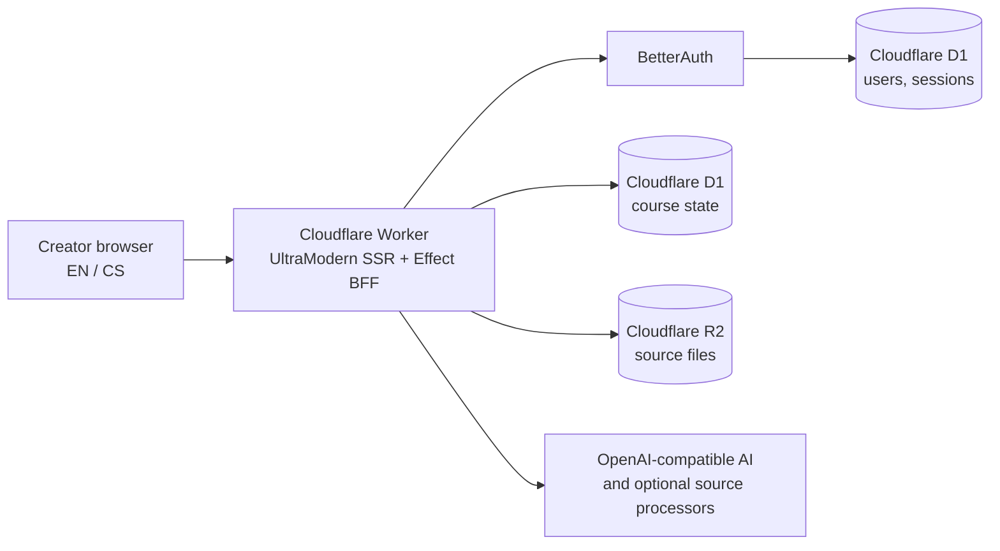

# CzechInvest acceptance audit — 2026-07-14

## Decision

**Technical GO for a controlled production deployment. Administrative GO remains conditional on the exact mandatory outputs in the signed ROPD and approved incubation plan.**

Coursition is now a working bilingual web product rather than an in-memory hackathon prototype. Authentication, sessions, course state, and uploaded source bytes use Cloudflare D1 and R2. The application builds as a native Cloudflare Worker, survives a Worker restart, uses the Techsio design system, and passes the repository quality gates.

Do not submit only a URL and a demo video. CzechInvest states that the last payment follows approval of the final report, that publicity duties are specified in the call and ROPD, and that monitoring duties are specified in the ROPD. The signed project documents therefore remain the acceptance contract: [CzechInvest Technological Incubation FAQ](https://czechinvest.gov.cz/cz/Sluzby-pro-startupy/Technologicka-inkubace/Casto-kladene-otazky-k-Technologicke-inkubaci-FAQ).

## Verified release state

| Area                        | Result | Evidence                                                                                                                                                  |
| --------------------------- | ------ | --------------------------------------------------------------------------------------------------------------------------------------------------------- |
| Runtime                     | Pass   | EN/CS sign-up and sign-in, dashboard, draft creation/resume, source form, workflow navigation, and playable UI exercised in a real browser                |
| Durability                  | Pass   | BetterAuth session and Czech course reopened from D1 after stopping and restarting Wrangler; API reported `cloudflare-d1-r2`                              |
| Automated tests             | Pass   | 47/47 tests in 6 files                                                                                                                                    |
| Type and Effect diagnostics | Pass   | `pnpm typecheck`, `pnpm effect-diagnostics:check`                                                                                                         |
| Localization                | Pass   | EN/CS key parity and hardcoded JSX-copy policy via `pnpm i18n:check`                                                                                      |
| Repository lint/format      | Pass   | Application sources pass Oxlint and oxfmt; generated output and the independent pitch-video package are intentionally excluded                            |
| Cloudflare build            | Pass   | Native Worker output, D1 migration, R2 binding, security headers, SSR, and dry-run upload validated                                                       |
| Production hydration        | Pass   | Minified Worker SSR exercised at `/en` and `/cs`; zero browser errors or console warnings, one localized title/description, and matched React boundaries  |
| Responsive UI               | Pass   | 375 px viewport has no document overflow; course title/actions are separated and the active step scrolls into view                                        |
| Design system               | Pass   | Techsio UI Kit atoms, molecules, templates, and token classes are used for buttons, inputs, forms, radio cards, steps, selects, badges, icons, and toasts |

Browser evidence is under `dogfood-output/cloudflare-2026-07-14/screenshots/`.

## Architecture delivered

The creator journey is:

`mode → sources → course preparation → objective map → activity plan → course content → playable preview`

The deployment uses the latest repository-supported UltraModern cohort `3.5.0-ultramodern.44`, pnpm `11.20.0`, Node 26+, TypeScript 7, strict Effect BFF, Drizzle, BetterAuth, Cloudflare D1, and Cloudflare R2. The migration removed obsolete compatibility shims and server-side route loaders that are incompatible with the current native Cloudflare adapter.

## Closed blockers from the first audit

- Replaced memory/JSON production storage with D1 course state and R2 source blobs.
- Added Drizzle schema and migration for BetterAuth plus the application store.
- Made BetterAuth require a real secret on Cloudflare/production.
- Proved session and draft persistence through a Worker restart.
- Removed recursive route-loader requests that exhausted the Worker.
- Restored route-aware client bootstrap for dashboard and direct course links.
- Removed the duplicate state request after authentication.
- Confirmed source creation and radio activity interactions in the browser.
- Labeled sample courses as demo content.
- Cleared incompatible source form fields when switching source type.
- Fixed the mobile course header, horizontal overflow, and active-step visibility.
- Added a production configuration validator and Cloudflare local-preview launcher.
- Patched current UltraModern/React 19 integration defects in Helmet ownership and TanStack loadable-route hydration; the patches are pinned and reproduced by pnpm.

## Remaining release conditions

These are external configuration or acceptance-contract tasks, not missing application implementation.

### 1. Freeze the acceptance contract

Copy every mandatory-output sentence from the signed ROPD, approved application/incubation plan, and every approved change into `czechinvest-output-evidence-matrix.md`. Have the incubation manager confirm any ambiguous interpretation in writing. CzechInvest's public FAQ cannot replace project-specific ROPD wording.

### 2. Supply production infrastructure and secrets

Verify the production D1 database, R2 bucket, final HTTPS origin, and AI/source-provider secrets described in `cloudflare-deployment-runbook.md`.

The verified dry run is approximately **1.95 MiB gzip**, including Ax. This is below Cloudflare's 3 MB Workers Free upload limit, so bundle size does not require Workers Paid. Recheck the compressed size at release time: [Cloudflare Workers limits](https://developers.cloudflare.com/workers/platform/limits/).

### 3. Run one provider-backed golden course

Against the frozen production URL:

1. Create a new CS account and course.
2. Add known notes plus one permitted URL or PDF.
3. Generate preparation, objectives, activities, and course content with the production AI key.
4. Complete all five activity engines in preview.
5. Sign out, sign in, and resume the course.
6. Record the run and retain the Worker deployment ID, commit SHA, timestamps, inputs, and screenshots.

### 4. Assemble the administrative binder

- Final report and exact output evidence matrix.
- User manual and deployment/backup/recovery runbook.
- Frozen URL, commit SHA, deployment log, demo credentials, and acceptance protocol.
- Demo video and screenshots showing CzechInvest/MPO publicity exactly as the ROPD requires.
- Supplier-selection, invoices, accounting class 518, separate-accounting, de-minimis, IP assignment, privacy, and OSS evidence applicable to the project.
- Written explanation connecting every claimed expense to development of the approved innovative product.

CzechInvest's FAQ says only services related to development and aligned with the call are eligible, costs are eligible from issuance of the ROPD, and project costs must not be double financed. Use the project's own documents and accounting adviser for the final eligibility decision.

## Explicit non-blockers

- The pitch-video package is independent evidence and is excluded from application lint/format. Its existing edits were preserved.
- Optional URL/PDF/transcription providers degrade by capability when their keys are absent; notes remain usable. For the acceptance recording, configure every provider the recorded scenario claims to use.
- The content-security policy is report-only during the acceptance run. Review reports, then switch it to enforcement as a post-submission hardening task.
- The current course store is one D1 JSON document plus R2 blobs. This is sufficient for the funded-product demonstration; normalization and multi-tenant scale work are deliberately deferred.

## Go/no-go rule

Submit when all of the following are true:

- every exact ROPD output row has an artifact, owner, objective pass criterion, and Pass status;
- the frozen Cloudflare URL passes the provider-backed golden course;
- D1/R2 backup and recovery have been exercised once;
- the final report, financial binder, IP/privacy/OSS evidence, and mandatory publicity are complete;
- the incubation manager has confirmed any disputed scope/evidence interpretation in writing.

No engineering team can guarantee CzechInvest approval. This release removes the known technical blockers; approval still depends on the signed obligations and evidence.
