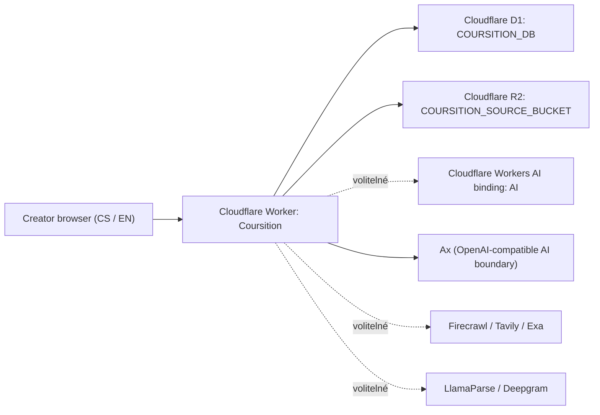
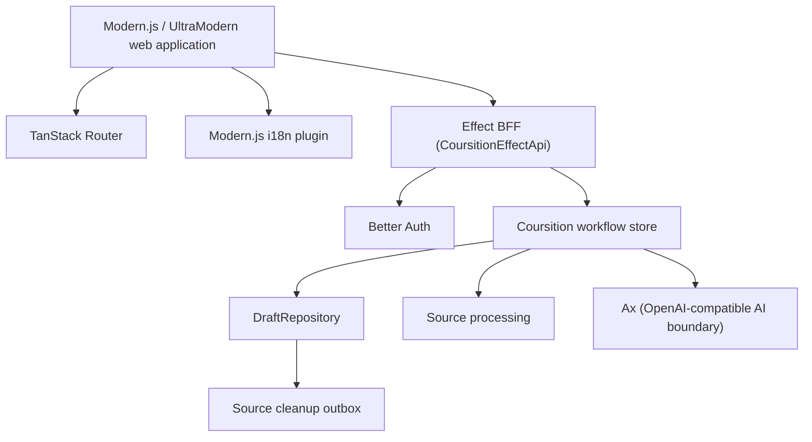
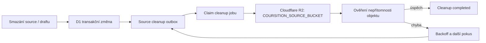

# Metodika pro IT

**Dokument:** Metodika pro IT  
**Produkt:** Coursition  
**Verze dokumentu:** 1.0  
**Datum:** 27. 7. 2026  
**Stav aplikace:** pracovní stav repozitáře k 4. 8. 2026, ověřeno na lokálně sestavené aplikaci (production build, localhost)

---

## Obsah

1. [Účel, cílová skupina a rozsah](#1-účel-cílová-skupina-a-rozsah)
2. [Architektura systému](#2-architektura-systému)
3. [Topologie nasazení](#3-topologie-nasazení)
4. [Struktura repozitáře důležitá pro provoz](#4-struktura-repozitáře-důležitá-pro-provoz)
5. [Veřejné routes a HTTP API](#5-veřejné-routes-a-http-api)
6. [Autentizace, session a autorizace](#6-autentizace-session-a-autorizace)
7. [Persistence, migrace a datový model](#7-persistence-migrace-a-datový-model)
8. [Zpracování zdrojů a životní cyklus souborů](#8-zpracování-zdrojů-a-životní-cyklus-souborů)
9. [AI vrstva a chování při selhání](#9-ai-vrstva-a-chování-při-selhání)
10. [Konfigurace](#10-konfigurace)
11. [Build, preview, release a nasazení](#11-build-preview-release-a-nasazení)
12. [Záloha, obnova a rollback](#12-záloha-obnova-a-rollback)
13. [Diagnostika, incident triage a eskalace](#13-diagnostika-incident-triage-a-eskalace)
14. [Automatizované testy a kontrola kvality](#14-automatizované-testy-a-kontrola-kvality)
15. [Bezpečnostní a provozní omezení](#15-bezpečnostní-a-provozní-omezení)
16. [Lokalizace a SEO s provozním dopadem](#16-lokalizace-a-seo-s-provozním-dopadem)
17. [Release a údržbový checklist](#17-release-a-údržbový-checklist)

---

## 1. Účel, cílová skupina a rozsah

Tato metodika popisuje současnou implementaci Coursition z pohledu vývojáře a provozovatele. Je určena zejména pro:

- vývojáře, kteří upravují doménovou logiku, API, UI, integrace nebo datový model;
- pracovníky odpovědné za sestavení a nasazení aplikace;
- pracovníky řešící incidenty, obnovu dat a provozní diagnostiku;
- testery, kteří posuzují připravenost nové verze k vydání.

Dokument vychází z aktuálního zdrojového kódu, migrací, release skriptů a automatizovaných testů. Lokální sestavení a testovací sady byly ověřeny k datu dokumentu. Dokument **nedokládá**, že byla stejným během ověřena konkrétní produkční URL, živé účty externích providerů, obnova produkční databáze ani produkční browser E2E scénář.

### 1.1 Co dokument pokrývá

- Modern.js / UltraModern webovou aplikaci a Effect BFF;
- Cloudflare Worker aplikace Coursition;
- Better Auth, session a owner-scoped autorizaci;
- Cloudflare D1 `COURSITION_DB` a Cloudflare R2 `COURSITION_SOURCE_BUCKET`;
- lokální persistence používanou mimo Cloudflare runtime;
- zpracování poznámek, URL a souborů;
- Ax a OpenAI-compatible AI hranici;
- volitelné integrace Firecrawl, Tavily, Exa, LlamaParse, Deepgram a Workers AI binding `AI`;
- migrace, build, preview, release, smoke testy, rollback a obnovu;
- lokalizaci, veřejné routes, canonical URL a generované SEO soubory v rozsahu, v němž ovlivňují provoz.

### 1.2 Co není součástí současného systému

Následující vlastnosti nejsou v aktuálním repozitáři implementovány nebo ověřeny jako aplikační schopnost:

- samostatný API server, Kubernetes, VM cluster nebo mikroservisní control plane;
- aplikační multi-region nebo vlastní HA/replikační strategie;
- periodický scheduler pro cleanup zdrojových objektů;
- kontinuální automatizovaná záloha D1 a automatizovaná záloha R2;
- automatizovaný end-to-end restore proces a doložený restore drill;
- role, týmy, organizace, sdílení kurzů nebo RBAC;
- aplikační per-user kvóty a rate limiting;
- plnohodnotný audit log;
- automatické smazání všech návrhů kurzů a R2 objektů při smazání uživatelského účtu;
- vynucující Content Security Policy; současná CSP je report-only;
- kompletní monitoring, alerting, SLO nebo on-call integrace;
- obecný deterministický fallback pro všechny AI fáze;
- garantované RTO, RPO, SLA, dostupnost nebo doba podpory;
- ověřená aplikační šifrovací vrstva pro JSON návrhů a obsah zdrojových souborů.

Tyto body jsou dále popsány jako známá omezení s provozními kompenzacemi, nikoli jako automatizované schopnosti produktu.

**Hlavní evidence:** `modern.config.ts`, `api/index.ts`, `shared/api.ts`, `server/coursition/`, `drizzle/`, `scripts/`, testy v `tests/`.

---

## 2. Architektura systému

Coursition je v produkčním Cloudflare sestavení jedna nasazovací jednotka. Cloudflare Worker hostuje server-side rendering, statické assety i BFF. Data návrhů a autentizace jsou v D1, binární obsah nahraných souborů v R2. Generativní AI a některé procesory zdrojů leží za externími síťovými hranicemi.

### 2.1 Kontext systému



**Obr. 1: Kontext produkčního nasazení.** Přerušovaná vazba znamená schopnost závislou na konfiguraci. Diagram neznázorňuje další aplikační služby, protože současný kód žádný samostatný scheduler, queue service ani API server nezavádí.

### 2.2 Logické komponenty uvnitř Workeru

Pojem „komponenta“ v této kapitole znamená logickou odpovědnost uvnitř jedné nasazovací jednotky. Nejde o Docker kontejnery ani samostatně škálované služby.



**Obr. 2: Logické komponenty v Cloudflare Workeru.** `DraftRepository` odděluje doménovou logiku od konkrétní persistence. Source bytes nejsou součástí normalizovaných SQL tabulek; jejich reference je v návrhu kurzu a bytes jsou ukládány blob adaptérem.

### 2.3 Matice odpovědností

| Komponenta                                   | Ověřená odpovědnost                                                                           | Co komponenta sama nezajišťuje                                      |
| -------------------------------------------- | --------------------------------------------------------------------------------------------- | ------------------------------------------------------------------- |
| **Modern.js / UltraModern web application**  | React UI, SSR, statické assety, napojení routeru, i18n a BFF pluginu                          | Není samostatná databáze ani AI provider                            |
| **TanStack Router**                          | Klientská route navigace a práce s locale-prefixed cestami                                    | Není bezpečnostní autorizační bariéra                               |
| **Modern.js i18n plugin**                    | Rozpoznání podporovaného jazyka a locale routing                                              | Neřídí vlastnictví návrhu kurzu                                     |
| **Effect BFF (`CoursitionEffectApi`)**       | Typovaný HTTP kontrakt a handlery pod `/api`                                                  | Neukládá data bez doménové/store vrstvy a repository                |
| **Better Auth**                              | E-mail/heslo, session cookie a serverový session lookup                                       | Samo neurčuje, zda uživatel vlastní konkrétní návrh                 |
| **Coursition workflow store**                | Doménové kroky, generation gates, revision, stale stavy, idempotence a orchestrace zpracování | Není obecná fronta úloh ani scheduler                               |
| **DraftRepository**                          | Rozhraní pro create/read/update/delete a rezervaci operací                                    | Není samostatná síťová služba ani ORM tabulka každé doménové entity |
| **Cloudflare D1 `COURSITION_DB`**            | Better Auth tabulky, návrhy, owner state, operace a cleanup outbox                            | Repo nedokládá aplikační replikační nebo multi-region návrh         |
| **Cloudflare R2 `COURSITION_SOURCE_BUCKET`** | Binární bytes nahraných souborů                                                               | Poznámky a URL nejsou ukládány jako R2 objekty                      |
| **Source processing**                        | Volba procesoru, validace typu, extrakce textu a tvorba odvozených dat                        | Nejde o asynchronní frontu; běžná cesta je synchronní               |
| **Source cleanup outbox**                    | Evidence požadavků na odstranění blobů, pokusy a backoff                                      | Nemá vlastní periodický trigger                                     |
| **Ax (OpenAI-compatible AI boundary)**       | Volání generativního endpointu pro vybrané fáze                                               | Negarantuje dostupnost ani univerzální fallback                     |
| **Cloudflare Workers AI binding `AI`**       | Volitelná konverze dokumentu na text                                                          | Není hlavním generativním modelem kurzu                             |
| **Firecrawl / Tavily / Exa**                 | Volitelná extrakce obsahu URL v definovaném pořadí                                            | Bez příslušného klíče je provider přeskočen                         |
| **LlamaParse**                               | Volitelné zpracování dokumentů                                                                | Kód neimplementuje následné mazání vzdáleného provider jobu/souboru |
| **Deepgram**                                 | Volitelný přepis audio/video obsahu                                                           | Bez konfigurace není audio/video capability dostupná                |

**Evidence:** `modern.config.ts:34-157`, `shared/api.ts:708-765`, `api/index.ts:189-318`, `server/coursition/auth.ts`, `server/coursition/store.ts`, `server/coursition/draft-repository.ts`, `server/coursition/source-processing.ts`, `server/coursition/source-cleanup.ts`.

---

## 3. Topologie nasazení

### 3.1 Produkční topologie

Produkční cloudflare target vzniká pouze při `MODERNJS_DEPLOY=cloudflare`. Build přepne runtime na Cloudflare, nastaví SSR a vytvoří Worker konfiguraci v `.output/wrangler.json`. Název výsledného Workeru je definován konstantou `cloudflareWorkerName` v `modern.config.ts` a promítá se do vygenerovaného `.output/wrangler.json`; Wrangler příkazy s `--config .output/wrangler.json` ho přebírají odtud, takže se v příkazech neuvádí ručně.

Produkční vazby:

- `COURSITION_DB` → Cloudflare D1;
- `COURSITION_SOURCE_BUCKET` → Cloudflare R2;
- `AI` → volitelný Cloudflare Workers AI binding pro konverzi dokumentů;
- odchozí HTTPS komunikace → nakonfigurovaný OpenAI-compatible endpoint a volitelní source provideři.

### 3.2 Lokální vývoj není druhá produkční architektura

Mimo cloudflare backend používá aplikace alternativní adaptéry:

- návrhy kurzů: JSON-file backend v datovém adresáři;
- autentizace: samostatná SQLite databáze;
- source bytes: lokální soubory;
- testy: mohou injektovat memory backend.

Lokální JSON/SQLite větev slouží k vývoji a testům. Nelze z ní odvozovat vlastnosti produkční D1/R2 persistence ani ji prezentovat jako on-prem variantu.

### 3.3 Datové a důvěryhodnostní hranice

1. **Prohlížeč ↔ Worker:** session cookie a HTTP payloady. Klientský redirect je UX; autorizační rozhodnutí musí proběhnout na serveru.
2. **Worker ↔ D1:** identity, session, validovaný JSON návrhu, revize, operace a cleanup outbox.
3. **Worker ↔ R2:** binární bytes souborů a jejich odstranění.
4. **Worker ↔ AI/source provideři:** část uživatelského obsahu je předána externímu providerovi podle aktivované capability. Provozovatel musí posoudit smluvní podmínky, retenci a dovolený typ dat.
5. **Release pracovní stanice ↔ Cloudflare:** Wrangler autentizace, vytváření prostředků, migrace, export a deploy. Release pracovní stanice je citlivá operátorská hranice.

**Evidence:** `modern.config.ts:22-31,66-157`, `server/coursition/store.ts:195-232`, `server/coursition/auth.ts:51-118`, `server/coursition/cloudflare-bindings.ts`.

---

## 4. Struktura repozitáře důležitá pro provoz

| Cesta                                     | Provozní význam                                                                                                  |
| ----------------------------------------- | ---------------------------------------------------------------------------------------------------------------- |
| `api/`                                    | Effect BFF handlery. Zde se získává session, převádějí chyby na HTTP odpovědi a volá workflow/evaluation.        |
| `shared/api.ts`                           | Sdílený typovaný kontrakt HTTP payloadů, chyb, source statusů, revizí a operací.                                 |
| `server/coursition/`                      | Auth, runtime config, workflow/store, repository adaptéry, AI provider, source processing, blob store a cleanup. |
| `src/routes/[lang]/`                      | Locale-prefixed stránky pro CS/EN, včetně veřejných a chráněných obrazovek.                                      |
| `locales/cs/` a `locales/en/`             | Uživatelská terminologie a překlady.                                                                             |
| `drizzle/`                                | Verzované SQL migrace `0000` až `0002`.                                                                          |
| `scripts/validate-cloudflare-release.mjs` | Fail-fast kontrola minimální release konfigurace a HTTPS originu.                                                |
| `scripts/deploy-cloudflare.mjs`           | D1 probe, podmíněný export, remote migrace, backfill/verify a deploy.                                            |
| `scripts/backfill-coursition-drafts.mjs`  | Převod legacy agregátu na per-draft authority; defaultně dry-run, `--apply` zapisuje.                            |
| `scripts/preview-cloudflare.mjs`          | Lokální Cloudflare build, lokální migrace a Wrangler preview s dočasným `.output/.dev.vars`.                     |
| `scripts/generate-seo-static.mjs`         | Generování `robots.txt` a `sitemap.xml` při načtení build konfigurace.                                           |
| `modern.config.ts`                        | Runtime target, Worker bindings, routing, canonical origin, observability a security headers.                    |
| `package.json`                            | Autoritativní seznam podporovaných build/test/release příkazů.                                                   |
| `rstest.config.mts`                       | Hlavní testovací sada v happy-dom.                                                                               |
| `rstest.d1.config.mts`                    | D1/source lifecycle sada v Node, sériově.                                                                        |

Při změně provozního chování je nutné posuzovat současně doménovou vrstvu, typovaný kontrakt, adapter a test. Například nový source status jen ve `shared/api.ts` ještě neznamená, že ho běžná runtime cesta skutečně vytváří.

---

## 5. Veřejné routes a HTTP API

### 5.1 Stránkové routes

Všechny aplikační stránky jsou locale-prefixed. Podporované jazyky jsou čeština a angličtina.

| Česká route                               | Anglická route                                 | Přístup               | Účel                 |
| ----------------------------------------- | ---------------------------------------------- | --------------------- | -------------------- |
| `/cs`                                     | `/en`                                          | veřejný               | Landing page         |
| `/cs/nastenka`                            | `/en/dashboard`                                | přihlášený uživatel   | Přehled návrhů kurzů |
| `/cs/prihlaseni`                          | `/en/sign-in`                                  | nepřihlášený uživatel | Přihlášení           |
| `/cs/registrace`                          | `/en/sign-up`                                  | nepřihlášený uživatel | Registrace           |
| `/cs/tvorba-kurzu/:courseId/rezim`        | `/en/course-creation/:courseId/mode`           | přihlášený vlastník   | Režim tvorby         |
| `/cs/tvorba-kurzu/:courseId/zdroje`       | `/en/course-creation/:courseId/sources`        | přihlášený vlastník   | Zdroje               |
| `/cs/tvorba-kurzu/:courseId/priprava`     | `/en/course-creation/:courseId/preparation`    | přihlášený vlastník   | Příprava kurzu       |
| `/cs/tvorba-kurzu/:courseId/cile`         | `/en/course-creation/:courseId/objectives`     | přihlášený vlastník   | Mapa cílů            |
| `/cs/tvorba-kurzu/:courseId/plan-aktivit` | `/en/course-creation/:courseId/activity-plan`  | přihlášený vlastník   | Plán aktivit         |
| `/cs/tvorba-kurzu/:courseId/obsah-kurzu`  | `/en/course-creation/:courseId/course-content` | přihlášený vlastník   | Obsah kurzu          |
| `/cs/tvorba-kurzu/:courseId/nahled`       | `/en/course-creation/:courseId/preview`        | přihlášený vlastník   | Náhled kurzu         |
| `/cs/ochrana-osobnich-udaju`              | `/en/privacy`                                  | veřejný               | Právní informace     |
| `/cs/obchodni-podminky`                   | `/en/terms`                                    | veřejný               | Právní informace     |

Chráněné stránky na klientu přesměrovávají nepřihlášeného uživatele. Tento redirect nesmí být považován za jedinou ochranu. Skutečnou bezpečnost dat poskytuje serverový session lookup a owner filter repository.

### 5.2 BFF endpoints

BFF je připojeno pod prefixem `/api`. OpenAPI dokument je dostupný na `/openapi.json`.

| Metoda a cesta                             | Session                       | Funkce                                                           |
| ------------------------------------------ | ----------------------------- | ---------------------------------------------------------------- |
| `GET /api/auth/session`                    | není nutná existující session | Vrátí session nebo `null`                                        |
| `POST /api/auth/sign-up`                   | veřejný                       | Registrace přes Better Auth a předání session cookie             |
| `POST /api/auth/sign-in`                   | veřejný                       | Přihlášení a předání session cookie                              |
| `POST /api/auth/sign-out`                  | předává se aktuální cookie    | Zrušení session                                                  |
| `POST /api/coursition/workflow`            | **povinná**                   | Jediný workflow endpoint; konkrétní operaci určuje `action`      |
| `POST /api/coursition/activity-evaluation` | **povinná**                   | AI hodnocení podporovaných otevřených aktivit v návrhu vlastníka |

Workflow endpoint pokrývá načtení stavu, vytvoření, výběr a smazání návrhu, navigaci, práci se zdroji, generování fází, retry a editace. Mutace používají:

- `expectedRevision` pro optimistic concurrency;
- `operationId` pro neopakovatelné/idempotentní operace;
- request fingerprint, který brání opětovnému použití stejného operation ID pro jiný vstup.

Při konfliktu revize vrací API typovanou odpověď HTTP 409 s autoritativním snapshotem. Klient má tento snapshot použít k revalidaci, nikoli slepě přepsat novější stav.

### 5.3 Význam častých HTTP stavů pro provoz

- **200:** požadavek byl zpracován; u session endpointu může být session zároveň `null`.
- **401:** session chybí nebo není platná. Při incidentu nejprve ověřit cookie/origin/`BETTER_AUTH_SECRET`, nikoli data návrhu.
- **404 / not found semantics:** může znamenat neexistující návrh i pokus přistoupit k návrhu jiného vlastníka. Systém záměrně neodhaluje cizí vlastnictví.
- **409:** stale `expectedRevision` nebo konflikt operace. Jde typicky o souběh klientů či starou UI state, ne o nedostupnost D1.
- **Provider/generation error:** doménová chyba může být persistována do AI runu nebo source statusu; je nutné rozlišit selhání providera od chyby persistence.

**Evidence:** `modern.config.ts:37-47,171-213`, `shared/coursition/routes.ts`, `shared/api.ts:455-765`, `api/index.ts:150-306`.

---

## 6. Autentizace, session a autorizace

### 6.1 Better Auth

Coursition používá Better Auth s e-mailovou registrací a přihlášením heslem. Server nastavuje a čte session cookie. Trusted origins zahrnují nakonfigurovaný veřejný origin a lokální loopback varianty pro vývoj.

Lokální runtime používá SQLite s WAL a foreign keys. Cloudflare runtime používá Drizzle D1 adapter. Auth schéma a doménové Coursition tabulky sdílejí v cloudflare režimu binding `COURSITION_DB`, ale mají rozdílné odpovědnosti.

### 6.2 Hesla

Hesla nejsou ukládána v plaintextu. Implementace používá:

- PBKDF2-HMAC-SHA256;
- náhodnou 16bytovou sůl;
- 256bitový odvozený klíč;
- 100 000 iterací;
- konstantně časové porovnání.

Hodnota 100 000 iterací je v kódu uvedena jako kompromis kvůli limitu workerd a je nižší než doporučení 600 000. Dokument proto tuto konfiguraci nepovažuje za maximální hardening; je to explicitní současné omezení runtime.

### 6.3 Session secret a origin

V production/cloudflare režimu je `BETTER_AUTH_SECRET` povinný. Vývojový fallback nesmí být použit pro produkci. Pro stabilitu session platí:

- zachovat stejný produkční secret napříč běžnými deployi;
- nevkládat hodnotu do repozitáře, dokumentace ani logu;
- po změně secretu očekávat zneplatnění existujících session;
- sladit `BETTER_AUTH_URL` nebo fallback `MODERN_PUBLIC_SITE_URL` se skutečným veřejným HTTPS originem.

### 6.4 Autorizační model

Autorizační model je jednoduchý: přihlášený uživatel je vlastníkem svých návrhů podle `ownerId`.

1. API odvodí user ID z ověřené session.
2. Workflow předá user ID do store/repository.
3. D1 read, update a delete kombinují draft ID s `owner_id`.
4. Owner snapshot čte pouze návrhy daného ownera.
5. Cizí návrh se projeví jako nenalezený.

AI evaluation navíc nejprve načte návrh přes owner-scoped lookup a dovolí hodnocení jen pro podporované typy `practice_task` a `rubric_answer`.

### 6.5 Co autorizace nepokrývá

- Neexistují admin role, týmová oprávnění ani sdílení návrhu.
- `coursition_operation` není audit log a nedokládá úplnou historii akcí.
- Coursition tabulky nemají foreign key na Better Auth `user`.
- Smazání auth účtu proto automaticky negarantuje smazání návrhů, cleanup řádků a R2 objektů.

**Evidence:** `server/coursition/auth.ts:29-119`, `server/coursition/password-hash.ts`, `api/index.ts:150-187,243-306`, `server/coursition/d1-draft-repository.ts:164-187,311-520`.

---

## 7. Persistence, migrace a datový model

### 7.1 Backend režimy

| Backend      | Návrhy kurzů                                | Auth                          | Source bytes                 | Použití                     |
| ------------ | ------------------------------------------- | ----------------------------- | ---------------------------- | --------------------------- |
| `json-file`  | JSON soubor v `COURSITION_DATA_DIR`         | lokální SQLite                | lokální soubory              | standardní lokální vývoj    |
| `memory`     | paměťový adapter                            | injektovaný/testovací runtime | paměťový/injektovaný adapter | automatizované testy        |
| `cloudflare` | D1 `coursition_draft` a související tabulky | Better Auth v D1              | R2                           | produkční Cloudflare target |

### 7.2 Better Auth a legacy tabulky

Migrace `0000` zavádí:

- `user` – identita a unikátní e-mail;
- `session` – token, expirace, IP/user-agent, vazba na uživatele;
- `account` – credential/provider data;
- `verification` – dočasné verifikační hodnoty;
- `coursition_store` – legacy agregovaný JSON ponechaný pro kompatibilitu a backfill.

Foreign key cascade je doložena pro `session` a `account` při smazání uživatele. Totéž neplatí pro Coursition návrhy.

### 7.3 Autoritativní Coursition tabulky

Migrace `0001` a `0002` zavádějí:

| Tabulka                     | Účel                                                                              |
| --------------------------- | --------------------------------------------------------------------------------- |
| `coursition_draft`          | Jeden schema-validovaný JSON payload na návrh, `owner_id`, revision a timestamps  |
| `coursition_owner_state`    | Monotónní revize stavu vlastníka                                                  |
| `coursition_operation`      | Rezervace operace, idempotence, lease a stav `pending`, `committed` nebo `failed` |
| `coursition_source_cleanup` | Outbox pro odstranění blobu, počet pokusů, chyba a čas dalšího pokusu             |

Doménové entity jako zdroje, derived documents, chunks, cíle, aktivity, obsah, findings a AI runs nejsou samostatné SQL tabulky. Jsou částí validovaného `CourseDraft` JSON payloadu.

### 7.4 Revision, CAS a idempotence

Každá změna návrhu pracuje s očekávanou revizí:

- revize je monotónní;
- D1 compare-and-swap odmítne stale mutaci;
- owner state se aktualizuje spolu s autoritativním návrhem;
- unikátní dvojice `(owner_id, operation_id)` chrání neopakovatelné operace;
- fingerprint brání změnit význam již použitého operation ID.

Tato ochrana řeší souběžné klienty a opakování HTTP požadavku. Nenahrazuje distribuovaný audit log ani obecný job queue systém.

### 7.5 Migrace

Schéma je verzováno SQL soubory v `drizzle/`. Generování a aplikace migrace jsou oddělené činnosti:

- `db:generate` vytvoří nebo změní soubory migrací;
- lokální preview aplikuje migrace proti lokální D1 emulaci;
- release skript aplikuje verzované migrace proti remote `COURSITION_DB`;
- následně spustí backfill a jeho verifikaci;
- Worker se deployuje až po úspěchu předchozích kroků.

Novou migraci musí vývojář zkontrolovat jako změnu datového kontraktu. Samotný průchod generátoru nedokládá bezpečnost migrace na reálném objemu produkčních dat.

### 7.6 Mazání návrhu

Smazání návrhu v cloudflare backendu je aplikační transakční operace. Zahrnuje:

1. owner-scoped kontrolu návrhu a revize;
2. odstranění autoritativního draft řádku;
3. commit idempotentní operace;
4. posun owner state;
5. vložení cleanup outbox řádků pro source reference.

R2 objekty se neodstraňují SQL cascade. Odstranění blobu je samostatný krok přes cleanup outbox.

**Evidence:** `server/coursition/storage-schema.ts`, `server/coursition/draft-repository.ts`, `server/coursition/d1-draft-repository.ts`, `drizzle/0000_magical_inertia.sql`, `drizzle/0001_warm_miss_america.sql`, `drizzle/0002_ancient_inertia.sql`.

---

## 8. Zpracování zdrojů a životní cyklus souborů

### 8.1 Vstupní typy

Workflow přijímá tři druhy zdrojů:

- `notes` – textová poznámka;
- `url` – URL nebo řetězec zadaný do URL vstupu;
- `file` – soubor přenesený jako Data URL.

Jméno zdroje je povinné. Notes a URL content nesmí být prázdný. U souboru je limit **10 MiB**, kontrolovaný v API schématu i po dekódování před zápisem blobu.

### 8.2 Validace souboru

Data URL musí obsahovat:

- omezeně dlouhý header;
- deklarovaný MIME typ;
- `base64` jako poslední metadata token;
- payload, který se vejde do odvozeného limitu.

U provider-backed binárních typů se skutečný typ ověřuje z bytes pomocí `file-type`. Deklarovaná přípona nebo MIME hlavička sama nestačí. U deklarovaného textového obsahu může být použit lokální textový fallback.

### 8.3 Procesory podle typu

| Vstup                                | Ověřená cesta                                                   | Poznámka                                                 |
| ------------------------------------ | --------------------------------------------------------------- | -------------------------------------------------------- |
| `text/*`                             | lokální text parser                                             | Bez externího providera                                  |
| JSON, JSON-LD, RTF, XHTML, XML, YAML | lokální text parser                                             | Podporováno explicitním MIME kontraktem                  |
| DOC, PDF, PPT, ODT, PPTX, DOCX       | LlamaParse, pokud je klíč; jinak Workers AI document conversion | Dostupnost závisí na provider konfiguraci/bindingu       |
| `audio/*`, `video/*`                 | Deepgram                                                        | Bez klíče není capability dostupná                       |
| `image/*`                            | nakonfigurovaný document converter                              | Nejde o samostatný OCR modul v aplikaci                  |
| URL                                  | Firecrawl → Tavily → Exa                                        | Provider bez klíče se přeskočí; po chybě se zkouší další |

### 8.4 URL chain a důležité omezení

Pro syntakticky platné `http:` nebo `https:` URL se zkoušejí provideři v pořadí Firecrawl, Tavily, Exa. Chybějící provider key daný krok přeskočí. Non-2xx odpověď, nečitelný provider payload nebo prázdný Markdown jsou chyby a chain pokračuje dalším providerem.

Současná implementace však syntakticky neplatnou URL striktně neodmítne. Takový vstup může spadnout do plain-source cesty a být označen jako `processed` jako raw text. Provozní nebo UI validace proto nemá být zaměňována za serverovou SSRF/content allowlist ochranu.

### 8.5 Statusy

Schéma připouští statusy:

- `uploaded`;
- `queued`;
- `processing`;
- `processed`;
- `partially_processed`;
- `failed`;
- `unsupported`;
- `deleted`.

Běžná současná synchronní `processSource` cesta přímo vytváří zejména `processed`, `failed` a `unsupported`; statusy `uploaded`, `queued`, `processing` a `partially_processed` jsou součástí kontraktu, nikoli důkaz asynchronní runtime fronty.

### 8.6 Uložení bytes a metadata

- Notes a URL nemají R2 objekt.
- Nahraný soubor má blob key odvozený z draft ID a source ID ve tvaru pod prefixem `source-assets/`.
- Draft JSON drží metadata a storage reference.
- R2 drží binární bytes.
- Externí reference, například LlamaParse reference, nemusí být R2 objektem a blob adapter ji nesmí považovat za lokální/R2 klíč.

Toto rozdělení znamená, že D1 a R2 musí být při záloze a obnově posuzovány společně.

### 8.7 Derived data

Pouze zdroj ve stavu `processed` nebo `partially_processed` s neprázdným obsahem vytváří:

- jeden `DerivedSourceDocument`;
- nejvýše 24 knowledge chunks;
- každý chunk nejvýše 1 200 znaků.

Přidání, retry nebo smazání zdroje aktualizuje derived data a označí závislé výstupy kurzu jako stale, aby nebyly považovány za aktuální vůči změněným podkladům.

### 8.8 Retry zdroje

Retry zachovává source ID a storage reference. U provider-backed souboru musí být původní bytes stále dostupné. Pokud objekt chybí, retry explicitně selže; systém nesmí předstírat nové zpracování bez původního vstupu.

Operátor při opakovaném selhání rozliší:

1. objekt v R2 existuje, ale provider selhává;
2. objekt v R2 chybí;
3. MIME/type validation odmítla vstup;
4. provider capability není nakonfigurována;
5. zdroj je `unsupported`, nikoli dočasně `failed`.

### 8.9 Delete a cleanup



**Obr. 3: Životní cyklus odstranění source blobu.** Úspěch SQL delete návrhu sám o sobě nedokládá odstranění R2 objektu.

Cleanup retry používá exponenciální prodlevu od jedné minuty s horním limitem jedné hodiny. Drain zpracovává joby sériově. Po úspěšném workflow API requestu se spouští best-effort drain s limitem pěti jobů.

**Zásadní omezení:** aplikace nemá cron ani scheduled trigger. Pokud po vzniku cleanup jobu nepřichází úspěšný workflow provoz, job nemusí být zpracován. Operátor musí backlog sledovat a při dlouhodobém klidu vyvolat bezpečný aplikační workflow provoz nebo připravit samostatný, řádně otestovaný provozní mechanismus; současná metodika takový mechanismus nevydává za existující automatizaci.

**Evidence:** `shared/api.ts:18-28,401-453`, `server/coursition/source-processing.ts:136-886`, `server/coursition/source-blob-store.ts`, `server/coursition/source-cleanup.ts:176-237`, `server/coursition/store.ts:365-484,1464-1643,2281-2293`.

---

## 9. AI vrstva a chování při selhání

### 9.1 Provider boundary

Generativní vrstva používá `@ax-llm/ax`. Aplikace vytváří Ax AI adapter s OpenAI-compatible API URL, credentialem, modelem, `temperature: 0`, non-streaming režimem a timeoutem. Interní provider label je `ax/openai-compatible`.

Zdrojový kód nefixuje jedinou upstream značku. Provozní tvrzení proto mají používat formulaci „OpenAI-compatible endpoint“, nikoli automaticky přisuzovat běh konkrétnímu providerovi nebo modelu.

### 9.2 Rozlišení konfigurace

- Base URL: `COURSITION_AI_BASE_URL`, poté alias `OPENAI_BASE_URL`, poté lokální vývojový default mimo skutečnou produkci.
- API key: `COURSITION_AI_PROVIDER_API_KEY`, poté alias `OPENAI_API_KEY`, lokální placeholder pouze pro local URL.
- Model: `COURSITION_AI_MODEL`, jinak kódový default.
- Timeout: `COURSITION_AI_TIMEOUT_MS`; testovací default je kratší než standardní runtime default.

Cloudflare build má vlastní fallback base URL/model pro sestavení, pokud proměnné nejsou nastaveny. Tato build hodnota **není důkazem**, že produkce skutečně používá daný model. Release evidence musí zaznamenat zvolený model ID a endpoint jako konfiguraci, ale nikdy ne credential.

`COURSITION_AI_ATTEMPTS` se načítá do runtime configu, ale současná retry policy jej nepoužívá. Klíč nesmí být prezentován jako aktivní ovládání počtu retry.

### 9.3 Generační fáze

| Fáze                        | Remote AI                                | Deterministická část                                                                                                     | Chování při selhání                                                                    |
| --------------------------- | ---------------------------------------- | ------------------------------------------------------------------------------------------------------------------------ | -------------------------------------------------------------------------------------- |
| Learning plan               | Ano, Ax node                             | Vznikne nejméně pět activity briefs; počet je maximem z počtu typů aktivit, vrácených briefů (nejvýše osmi) a počtu cílů | Bez obecného lokálního fallbacku; failed AI run                                        |
| Příprava kurzu              | Ano, samostatný Ax node                  | Normalizace/validace kontraktu                                                                                           | Bez obecného lokálního fallbacku                                                       |
| Interaktivní aktivity       | U non-free modelu writer + quality judge | U modelů označených jako free se karty renderují lokálně z briefů                                                        | Jednotlivá chyba může vytvořit `not_playable`; selhání všech briefů ukončí fázi chybou |
| Obsah kurzu                 | Ne                                       | Lokální renderer skládá vysvětlení, aktivity a shrnutí                                                                   | Chyba je aplikační/kontraktová, ne výpadek remote modelu                               |
| Hodnocení otevřené odpovědi | Ano                                      | Normalizace odpovědi                                                                                                     | Bez obecného lokálního fallbacku                                                       |

### 9.4 Writer/judge smyčka

U non-free modelů se pro interaktivní aktivity používá writer a quality judge. Writer může dostat zpětnou vazbu a opakovat pokus maximálně třikrát. Quality threshold je 0,82. Toto je specifická interní smyčka pro aktivitu, nikoli univerzální retry transportních chyb a není řízena `COURSITION_AI_ATTEMPTS`.

### 9.5 Skutečně existující deterministické cesty

Současný kód obsahuje tři úzké deterministické cesty:

1. materializace nejméně pěti activity briefs; počet je maximem z počtu typů aktivit, vrácených briefů (nejvýše osmi) a počtu cílů;
2. lokální renderer interaktivních aktivit pro free-model režim;
3. lokální renderer obsahu kurzu.

Neexistuje důkaz, že při výpadku remote AI lze deterministicky dokončit learning plan, přípravu kurzu nebo AI hodnocení otevřené odpovědi.

### 9.6 Failure a recovery behavior

- Chybějící provider config vyvolá explicitní chybu.
- Provider nebo kontraktová chyba se převádí na typovaný error.
- Store persistuje failed AI run.
- `running` run starší patnácti minut je považován za přerušený, označí se jako failed a může být explicitně opakován.
- Jednotlivá nepodařená aktivita může být `not_playable`.
- Uživatel musí AI výstup odborně zkontrolovat; úspěšná technická generace nedokládá faktickou správnost.

### 9.7 Provozní evidence pro AI incident

Bez logování credentialu zaznamenat:

- čas incidentu a deployment/version identifikátor;
- typ fáze;
- model ID;
- provider label a hostname endpointu, pokud interní politika dovoluje;
- HTTP status nebo aplikační error tag;
- zda šlo o timeout, transportní chybu, neplatný strukturovaný výstup nebo obsahové odmítnutí;
- draft ID pouze podle pravidel interního přístupu a bez kopírování citlivého source obsahu;
- zda vznikl failed AI run a zda je dostupný explicitní retry.

Nikdy nezaznamenávat API key, session cookie, celé heslo ani celý obsah důvěrného zdroje.

**Evidence:** `server/coursition/ai-provider-config.ts`, `server/coursition/ai-provider.ts:374-694,947-980,1671-2017`, `server/coursition/store.ts:137-138,505-556,629-643,849-1104,1644-1751`.

---

## 10. Konfigurace

Hodnoty secretů nejsou součástí metodiky. Tabulky uvádějí pouze názvy, účel a citlivost.

### 10.1 Klíče povinné pro release validator

| Klíč                          | Účel                                            | Citlivost                             | Poznámka                          |
| ----------------------------- | ----------------------------------------------- | ------------------------------------- | --------------------------------- |
| `BETTER_AUTH_SECRET`          | Podpis a ochrana auth/session mechanismu        | **secret**                            | Povinný pro production/cloudflare |
| `CLOUDFLARE_D1_DATABASE_ID`   | ID D1 prostředku pro build binding              | interní infrastrukturní identifikátor | Povinný pro release               |
| `CLOUDFLARE_D1_DATABASE_NAME` | Název D1 databáze                               | interní/veřejný identifikátor         | Povinný pro release               |
| `CLOUDFLARE_R2_BUCKET_NAME`   | Název R2 bucketu                                | interní/veřejný identifikátor         | Povinný pro release               |
| `MODERN_PUBLIC_SITE_URL`      | Veřejný origin, canonical, hreflang a auth base | veřejný, provozně kritický            | Release vyžaduje HTTPS            |

### 10.2 Runtime a build

| Klíč                                    | Účel                                          | Citlivost / stav           |
| --------------------------------------- | --------------------------------------------- | -------------------------- |
| `NODE_ENV`                              | Development/test/production větvení           | veřejný                    |
| `MODERNJS_DEPLOY`                       | Přepnutí targetu, zejména `cloudflare`        | veřejný                    |
| `BETTER_AUTH_URL`                       | Explicitní auth origin; jinak site URL        | veřejný, provozně kritický |
| `COURSITION_STORE_BACKEND`              | Volba `json-file`, `memory` nebo `cloudflare` | veřejný                    |
| `COURSITION_DATA_DIR`                   | Lokální root návrhů a source assets           | interní cesta              |
| `COURSITION_AUTH_DATABASE`              | Lokální SQLite auth cesta                     | interní cesta              |
| `MODERN_BASELINE_APP_ID`                | App ID pro build/cache integraci              | veřejný                    |
| `MODERN_BASELINE_ENABLE_BFF_REQUEST_ID` | Zapnutí BFF request ID                        | veřejný; defaultně zapnuto |
| `MODERN_BASELINE_ENABLE_MF_SSR`         | Module federation SSR                         | veřejný; defaultně zapnuto |
| `ULTRAMODERN_RSDOCTOR`                  | Build diagnostika                             | veřejný                    |
| `CLOUDFLARE_PREVIEW_PORT`               | Volba volného portu lokálního preview         | lokální provozní hodnota   |

### 10.3 Generativní AI

| Klíč                             | Účel                                       | Citlivost / stav              |
| -------------------------------- | ------------------------------------------ | ----------------------------- |
| `COURSITION_AI_PROVIDER_API_KEY` | Primární OpenAI-compatible credential      | **secret**                    |
| `OPENAI_API_KEY`                 | Alias credential                           | **secret**                    |
| `COURSITION_AI_BASE_URL`         | Primární provider endpoint                 | veřejný nebo interní endpoint |
| `OPENAI_BASE_URL`                | Alias endpoint                             | veřejný nebo interní endpoint |
| `COURSITION_AI_MODEL`            | Model ID                                   | veřejný provozní údaj         |
| `COURSITION_AI_TIMEOUT_MS`       | Timeout volání v milisekundách             | veřejný                       |
| `COURSITION_AI_ATTEMPTS`         | Načtený klíč, aktuálně bez účinku na retry | veřejný; **nepoužitý**        |

### 10.4 Source provideři

| Klíč                   | Účel                                            | Citlivost                        |
| ---------------------- | ----------------------------------------------- | -------------------------------- |
| `FIRECRAWL_API_KEY`    | URL extraction přes Firecrawl                   | **secret**                       |
| `FIRECRAWL_BASE_URL`   | Override endpointu Firecrawl                    | veřejný/interní endpoint         |
| `TAVILY_API_KEY`       | URL extraction přes Tavily                      | **secret**                       |
| `TAVILY_BASE_URL`      | Override endpointu Tavily                       | veřejný/interní endpoint         |
| `EXA_API_KEY`          | URL extraction přes Exa                         | **secret**                       |
| `EXA_BASE_URL`         | Override endpointu Exa                          | veřejný/interní endpoint         |
| `LLAMA_CLOUD_API_KEY`  | LlamaParse upload/job API                       | **secret**                       |
| `LLAMA_CLOUD_BASE_URL` | Llama Cloud endpoint                            | veřejný/interní endpoint         |
| `LLAMA_PARSE_TIER`     | `cost_effective`, `agentic` nebo `agentic_plus` | veřejný; neplatná hodnota failne |
| `LLAMA_PARSE_VERSION`  | Verze LlamaParse                                | veřejný                          |
| `DEEPGRAM_API_KEY`     | Audio/video transcription                       | **secret**                       |
| `DEEPGRAM_BASE_URL`    | Deepgram endpoint                               | veřejný/interní endpoint         |
| `DEEPGRAM_MODEL`       | Transcription model                             | veřejný                          |
| `DEEPGRAM_LANGUAGE`    | Jazyk transcription                             | veřejný                          |

Tyto klíče jsou capability-volitelné. Runtime nevyžaduje všechny source provider credentials současně. Samostatný `push-cloudflare-secrets.mjs` však vyžaduje sedm secret names najednou; není zapojen do `cloudflare:deploy`. Operátor proto nemá zaměňovat požadavky tohoto administrativního skriptu za minimální runtime kontrakt.

### 10.5 Telemetrie

| Klíč                                         | Účel                                       | Stav                       |
| -------------------------------------------- | ------------------------------------------ | -------------------------- |
| `MODERN_BASELINE_ENABLE_TELEMETRY_EXPORTERS` | Zapnutí UltraModern exporterů              | defaultně vypnuto          |
| `MODERN_TELEMETRY_OTLP_ENDPOINT`             | Cíl OTLP exportu                           | volitelný interní endpoint |
| `MODERN_TELEMETRY_VICTORIA_ENDPOINT`         | Cíl VictoriaMetrics exportu                | volitelný interní endpoint |
| `MODERN_TELEMETRY_FAIL_LOUD_STARTUP`         | Zda selhat při problému telemetry startupu | defaultně vypnuto          |

Wrangler observability je v konfiguraci zapnuta, ale to samo nedokládá historickou retenci, alert rules, SLO ani doručování incidentů.

### 10.6 Pravidla správy konfigurace

- Secret zadávat interaktivně nebo schváleným secret management postupem.
- Secret nikdy nevkládat do Markdownu, issue, screenshotu, shell history nebo logu.
- Ve release záznamu uvádět jen název klíče a stav „nastaven/nenastaven“, ne hodnotu.
- Změnu `MODERN_PUBLIC_SITE_URL`, `BETTER_AUTH_URL`, D1 ID nebo R2 bucketu považovat za změnu topologie, ne za běžný UI deploy.
- Změnu AI modelu nebo endpointu doplnit golden-course ověřením, protože může změnit strukturu i kvalitu výstupu.

**Evidence:** `server/coursition/config.ts:112-196`, `server/coursition/ai-provider-config.ts`, `modern.config.ts:22-166`, `scripts/validate-cloudflare-release.mjs`, `scripts/push-cloudflare-secrets.mjs`.

---

## 11. Build, preview, release a nasazení

### 11.1 Požadavky pracovní stanice

Repozitář deklaruje Node.js 26 nebo novější, pnpm 11 nebo novější a package manager `pnpm@11.20.0`. Doporučený vstup je přes `mise`, aby se použily verzované nástroje projektu.

Následující instalační příkazy mění pouze lokální toolchain a dependencies, nikoli cloudové prostředky:

```bash
mise install
mise exec -- pnpm install --frozen-lockfile
```

### 11.2 Přehled package scripts

| Příkaz                        | Chování                                                                                               |
| ----------------------------- | ----------------------------------------------------------------------------------------------------- |
| `pnpm dev`                    | Modern.js development server                                                                          |
| `pnpm build`                  | Standardní Modern.js build                                                                            |
| `pnpm serve`                  | Obsluha standardního buildu                                                                           |
| `pnpm cloudflare:build`       | Cloudflare target build a vytvoření deploy outputu; bez remote deploye                                |
| `pnpm cloudflare:preview`     | Build, lokální D1 migrace a Wrangler local preview                                                    |
| `pnpm cloudflare:deploy`      | Validate → Cloudflare build → D1 export/migrace/backfill/verify → deploy                              |
| `pnpm db:generate`            | Vygeneruje kandidátní SQL migraci, neaplikuje databázi                                                |
| `pnpm db:backfill:coursition` | Defaultně dry-run remote backfill analýza; `--apply` zapisuje                                         |
| `pnpm test`                   | Hlavní testy a automatický `posttest` s D1 sadou                                                      |
| `pnpm test:d1`                | Pouze D1/source lifecycle sada                                                                        |
| `pnpm release:check`          | Typecheck, Effect diagnostika, i18n, testy, kontrola agentních skills a UltraModern release kontrakty |
| `pnpm ultramodern:check`      | Širší formát/lint/type/test/contract kontrola                                                         |

### 11.3 Bezpečné lokální kontroly

Tyto příkazy nemění remote Cloudflare stav:

```bash
mise exec -- pnpm typecheck
mise exec -- pnpm effect-diagnostics:check
mise exec -- pnpm i18n:check
mise exec -- pnpm test
mise exec -- pnpm release:check
```

`pnpm test` spustí díky `posttest` hlavní i D1 testovací sadu. Není nutné bezdůvodně spouštět `test:d1` podruhé.

### 11.4 Lokální Cloudflare preview

Preview vyžaduje lokální `.dev.vars`. Kopie šablony je pouze výchozí soubor; před spuštěním je nutné doplnit bezpečné lokální testovací hodnoty, nikoli produkční secrets.

```bash
cp .dev.vars.example .dev.vars
mise exec -- pnpm cloudflare:preview
```

Launcher:

1. ověří existenci `.dev.vars`;
2. ověří minimální délku lokálního `BETTER_AUTH_SECRET`;
3. sestaví Cloudflare target;
4. aplikuje migrace na lokální D1 emulaci;
5. vytvoří dočasný `.output/.dev.vars` s omezenými právy;
6. spustí `wrangler dev`;
7. v `finally` dočasný soubor odstraní.

Pokud je výchozí port obsazený, nastaví operátor `CLOUDFLARE_PREVIEW_PORT` na volný port. Hodnota je lokální a nesmí měnit produkční origin.

### 11.5 Generování migrace

Tento příkaz zapisuje do `drizzle/`, ale neaplikuje databázi:

```bash
mise exec -- pnpm db:generate
```

Po vygenerování je nutné:

1. zkontrolovat SQL diff;
2. ověřit, že migrace neodstraňuje data bez schváleného plánu;
3. doplnit nebo upravit testy repository a backfillu;
4. spustit lokální preview s čistým i existujícím lokálním stavem;
5. neposuzovat migraci jen podle úspěšného TypeScript buildu.

### 11.6 Bezpečný Cloudflare build a dry-run

Build zapisuje lokální artefakty, ale neuploaduje Worker:

```bash
mise exec -- pnpm cloudflare:build
mise exec -- pnpm exec wrangler deploy --dry-run --config .output/wrangler.json
```

Dry-run je vhodný pro kontrolu vygenerované Wrangler konfigurace a upload balíku před remote release. Nenahrazuje testy ani post-deploy smoke.

### 11.7 Zobrazení remote migrací

Následující příkaz čte stav remote D1 a neaplikuje migrace:

```bash
mise exec -- pnpm exec wrangler d1 migrations list COURSITION_DB --remote --config .output/wrangler.json
```

Před příkazem musí existovat aktuální `.output/wrangler.json` z Cloudflare buildu.

### 11.8 Release pipeline

#### Závazné pořadí prvního nasazení

`cloudflare:deploy` secrets **nenahrává**. Při prvním nasazení cílového Workeru proto platí toto pořadí; spuštění `cloudflare:deploy` jako první krok vede k nasazenému Workeru bez secretů, který selže na autentizaci i na provider volání:

1. `mise exec -- pnpm cloudflare:build` — vznikne `.output/wrangler.json` potřebný pro adresaci Workeru;
2. interaktivní nahrání secretů podle [§11.10](#1110-ruční-kroky-které-release-skript-nedělá) (`wrangler secret put ... --config .output/wrangler.json`) a ověření názvů příkazem `wrangler secret list`;
3. `mise exec -- pnpm cloudflare:deploy` — validace, build, D1 export, migrace, backfill a deploy Workeru;
4. smoke test podle [§11.11](#1111-post-deploy-smoke-test) a připojení custom domain.

Toto pořadí odpovídá sekci _First deployment_ v `docs/cloudflare-deployment-runbook.md`.

Běžný následující release může začít přímo krokem 3, ale jen tehdy, když cílový Worker už má nahrané všechny potřebné secrets a jejich hodnoty se nemění. Jakmile se přidává nový provider nebo rotuje klíč, platí znovu celé pořadí 1–4.

#### Průběh release skriptu

```mermaid
flowchart LR
    START["pnpm cloudflare:deploy"] --> VAL["validate-cloudflare-release"]
    VAL --> BUILD["cloudflare:build"]
    BUILD --> PROBE["D1 table probe"]
    PROBE --> EXP["Podmíněný D1 export"]
    EXP --> MIG["migrations apply --remote"]
    MIG --> BF["backfill --apply + verify"]
    BF --> DEP["wrangler deploy"]
    MAN["Ruční kroky operátora"] -. resources / secrets / smoke .-> START
```



**Obr. 4: Fail-fast release pipeline.** Export se přeskočí u první databáze bez tabulek. Upload secretů není součástí pipeline.

Release skript provede přesně tuto posloupnost:

1. validátor vyžádá `BETTER_AUTH_SECRET`, D1 ID/name, R2 bucket a HTTPS site URL;
2. vznikne Cloudflare build a `.output/wrangler.json`;
3. remote D1 probe zjistí ne-systémové tabulky;
4. existující databáze se exportuje do `artifacts/backups` a soubor dostane oprávnění 0600;
5. aplikují se remote migrace;
6. spustí se backfill `--apply` a verifikace;
7. až poté se deployuje Worker.

Výjimka v libovolném kroku přeruší další průběh. Selhání migrace nebo backfillu tak zabrání deployi nového Workeru, ale již úspěšně aplikovaná databázová změna se tím automaticky nevrací.

### 11.9 Remote zápis: produkční deploy

> **Pozor – zapisuje do produkční D1 a nasazuje Worker.** Spustit pouze se schváleným release oknem, aktuální Cloudflare autentizací, ověřenou konfigurací a plánem rollbacku.

```bash
mise exec -- pnpm cloudflare:deploy
```

### 11.10 Ruční kroky, které release skript nedělá

Tyto kroky patří do pořadí prvního nasazení popsaného v §11.8; nahrání secretů je krok 2, tedy až po `cloudflare:build` a ještě před `cloudflare:deploy`.

Operátor musí samostatně:

- zajistit Cloudflare účet a Wrangler autentizaci;
- vytvořit a identifikovat D1 a R2 prostředky;
- zvolit finální HTTPS origin;
- bezpečně vytvořit a uložit auth a provider secrets;
- **nahrát potřebné secrets do cílového Workeru; `cloudflare:deploy` je nenahrává**;
- nakonfigurovat pouze skutečně používané source providery;
- připojit custom domain;
- schválit maintenance/release window;
- po deployi provést smoke test;
- zaznamenat deployment/version identifikátor a výsledek smoke testu;
- archivovat relevantní release evidence a D1 export;
- samostatně zajistit R2 backup podle provozní politiky.

> **Pozor – následující příkazy zapisují remote secrets do Cloudflare Workeru.** Hodnotu zadávejte až do interaktivní výzvy Wrangleru; nevkládejte ji do příkazové řádky, dokumentace ani logu.

Po vytvoření `.output/wrangler.json` nahrajte povinný auth secret:

```bash
mise exec -- pnpm exec wrangler secret put BETTER_AUTH_SECRET --config .output/wrangler.json
```

Pokud release používá generativní AI, nahrajte jeden skutečně používaný credential, například primární klíč:

```bash
mise exec -- pnpm exec wrangler secret put COURSITION_AI_PROVIDER_API_KEY --config .output/wrangler.json
```

Stejným per-secret postupem nahrajte pouze klíče aktivovaných source providerů. Skript `scripts/push-cloudflare-secrets.mjs` je hromadný administrativní postup a vyžaduje všech sedm podporovaných hodnot; není minimálním first-deploy postupem.

Stav názvů lze ověřit bez výpisu hodnot příkazem:

```bash
mise exec -- pnpm exec wrangler secret list --config .output/wrangler.json
```

Po nahrání proveďte auth smoke test; provider smoke test proveďte jen pro capabilities zahrnuté do release acceptance.

### 11.11 Post-deploy smoke test

Minimální smoke test je ruční a musí proběhnout na finální produkční URL:

1. otevřít `/cs` a `/en`; ověřit HTTP 200 a správný jazyk;
2. ověřit `GET /api/auth/session`; endpoint má vrátit HTTP 200 i bez přihlášené session;
3. vytvořit čistý testovací účet podle provozní politiky;
4. vytvořit návrh kurzu a přidat alespoň jeden bezpečný testovací zdroj;
5. odhlásit se, znovu přihlásit a otevřít návrh z nástěnky;
6. ověřit source preview a persistence;
7. pokud je AI součástí release acceptance, spustit schválený golden-course scénář;
8. ověřit, že v D1 jsou migrace `0000` až `0002` a žádná očekávaná migrace nechybí;
9. ověřit, že nahraný soubor skutečně vytvořil R2 objekt a po restartu zůstává dostupný;
10. zaznamenat výsledek bez credentials a bez osobních dat.

Automatizované unit/integration testy tento produkční smoke nenahrazují.

---

## 12. Záloha, obnova a rollback

### 12.1 Co je automatizováno

`cloudflare:deploy` obsahuje pouze **podmíněný pre-migration export D1**:

- pokud remote D1 nemá žádné aplikační tabulky, export se přeskočí;
- jinak se před migrací vytvoří SQL export;
- export se uloží lokálně do ignorovaného `artifacts/backups`;
- soubor dostane režim 0600.

Jde o release snapshot databáze před migrací, nikoli o kontinuální backup systém. Repo neimplementuje automatizované kopírování tohoto souboru do dlouhodobého úložiště.

### 12.2 Co automatizováno není

- pravidelný D1 backup mimo release;
- R2 backup;
- společný manifest D1 exportu a R2 objektů;
- automatický restore do náhradní databáze;
- automatické přepnutí bindingu;
- restore drill;
- aplikačně garantovaná retence záloh.

### 12.3 Ruční D1 export

Následující postup čte remote D1 a zapisuje lokální backup soubor. Operátor musí nahradit jméno souboru skutečným časovým označením a chránit jeho obsah.

```bash
mkdir -p artifacts/backups
mise exec -- pnpm exec wrangler d1 export COURSITION_DB --remote --config .output/wrangler.json --output artifacts/backups/coursition-YYYYMMDD-HHMM.sql
chmod 600 artifacts/backups/coursition-YYYYMMDD-HHMM.sql
```

Po exportu:

1. ověřit, že příkaz skončil úspěchem a soubor není prázdný;
2. uložit checksum podle interní politiky;
3. přenést soubor do schváleného chráněného úložiště;
4. spojit ho s deployment/version identifikátorem;
5. zaznamenat odpovídající R2 manifest nebo snapshot reference.

### 12.4 R2 backup

Repo neobsahuje R2 backup skript ani manifest tool. Provozovatel musí samostatně použít schválený S3-compatible backup nástroj nebo platformní mechanismus a zachovat vazbu mezi:

- D1 exportem;
- R2 snapshotem/kopií;
- seznamem objektových klíčů;
- časem zálohy;
- verzí aplikace a schématu.

Databázová záloha bez odpovídajících R2 objektů je neúplná, protože draft JSON obsahuje reference na source bytes.

### 12.5 Rollback aplikace

Při regresi pouze v aplikačním kódu:

1. zastavit další release změny;
2. v Cloudflare použít rollback na předchozí ověřenou Worker verzi;
3. **nevracet automaticky D1**, pokud problém nevyžaduje datovou obnovu;
4. provést stejný smoke test jako po deployi;
5. ověřit kompatibilitu předchozí verze Workeru s aktuálním schématem D1;
6. zaznamenat, zda během incidentu proběhly migrace.

Aplikační rollback nevrací D1 migrace ani obsah R2. Pokud nová migrace není backward compatible, samotný rollback Workeru může být nedostatečný.

### 12.6 D1 Time Travel

Cloudflare D1 Time Travel je platformní remote-only obnova do bodu podle bookmarku nebo timestampu. Retence závisí na aktuálním plánu Cloudflare. Restore přepisuje databázi in-place a ovlivní probíhající dotazy.

Nejprve lze číst informace:

```bash
mise exec -- pnpm exec wrangler d1 time-travel info COURSITION_DB --config .output/wrangler.json
```

> **Pozor – následující operace je destruktivní, remote-only a přepisuje D1 in-place.** Provést pouze v maintenance window, po čerstvém exportu, se schválením a se zaznamenaným pre-restore bookmarkem.

```bash
mise exec -- pnpm exec wrangler d1 time-travel restore COURSITION_DB --bookmark='<bookmark>' --config .output/wrangler.json
```

Povinný postup:

1. potvrdit správnou databázi a účet;
2. zastavit nebo organizačně omezit zápisy;
3. vytvořit čerstvý export a R2 stavový záznam;
4. získat a uložit pre-restore bookmark pro možnost odvolání restore;
5. provést restore na schválený bookmark;
6. ověřit auth, návrhy a source reference;
7. porovnat D1 reference s dostupnými R2 objekty;
8. znovu povolit provoz až po smoke testu.

### 12.7 SQL obnova do náhradní D1

Bezpečnější variantou při nejistotě je obnova do náhradní databáze:

1. vytvořit náhradní D1;
2. importovat uložený SQL export;
3. ověřit tabulky, počty, revize a vzorky validovaných payloadů;
4. obnovit odpovídající R2 data;
5. aktualizovat `CLOUDFLARE_D1_DATABASE_ID` pro nové prostředí;
6. znovu sestavit Worker a provést dry-run;
7. nasadit v maintenance window;
8. provést sign-in → resume → source preview → course preview acceptance kontrolu.

Import přes `wrangler d1 execute ... --remote --file ...` zapisuje remote databázi a nesmí být spuštěn proti produkčnímu bindingu bez výslovného plánu. Tato metodika záměrně neposkytuje „jednokrokový“ copy-paste restore, protože správný cíl musí operátor nejprve jednoznačně identifikovat.

### 12.8 Obnova nebyla tímto dokumentem odzkoušena

Popsané recovery kroky vycházejí z aktuálního release skriptu, Wrangler kontraktu a Cloudflare dokumentace. K datu dokumentu nebyl proveden produkční restore drill. Provozovatel má před ostrým provozem provést kontrolovaný nácvik na izolované náhradní D1/R2 sadě a uchovat protokol.

Platformní reference:

- D1 import/export: <https://developers.cloudflare.com/d1/best-practices/import-export-data/>
- D1 Time Travel: <https://developers.cloudflare.com/d1/reference/time-travel/>
- R2 data security: <https://developers.cloudflare.com/r2/reference/data-security/>

---

## 13. Diagnostika, incident triage a eskalace

### 13.1 Dostupné signály

- HTTP statusy a typované BFF chyby;
- Cloudflare Workers real-time logs;
- Wrangler observability nastavení;
- volitelné UltraModern telemetry exportery;
- D1 tabulky návrhů, operací a cleanup outboxu;
- persistované AI run statusy;
- source statusy `processed`, `failed`, `unsupported`, `deleted`;
- lokální Cloudflare preview pro reprodukci.

`coursition_operation` je technická evidence idempotence/lease, nikoli úplný audit trail. Real-time logs jsou ephemerální a mohou být samplované. Historická retence nebo export musí být nakonfigurovány zvlášť.

### 13.2 Real-time Worker logs

Následující příkaz pouze streamuje real-time logy; nemění Worker ani data:

```bash
mise exec -- pnpm exec wrangler tail --config .output/wrangler.json --format pretty
```

Při práci s logy:

- nepřenášet session cookies ani secrets do ticketu;
- omezit kopírování user content;
- používat čas, route, status, request ID a error tag;
- počítat s tím, že chybějící záznam nedokazuje, že událost nenastala;
- u dlouhodobé analýzy ověřit skutečně nakonfigurovanou retenci/export.

Cloudflare reference:

- <https://developers.cloudflare.com/workers/observability/logs/>
- <https://developers.cloudflare.com/workers/observability/logs/real-time-logs/>

### 13.3 Triage podle symptomu

| Symptom                           | První kontroly                                                                | Pravděpodobná hranice      | Bezpečný další krok                                              |
| --------------------------------- | ----------------------------------------------------------------------------- | -------------------------- | ---------------------------------------------------------------- |
| Landing neodpovídá                | Worker deployment, custom domain, origin, Worker logs                         | Cloudflare route/deploy    | Ověřit předchozí verzi a případně aplikační rollback             |
| `/api/auth/session` vrací 401/5xx | `BETTER_AUTH_SECRET`, origin, D1 binding, auth tabulky                        | Better Auth / D1           | Reprodukce v preview, kontrola migrací; neměnit secret bez plánu |
| Uživatel nevidí svůj kurz         | Session user ID, owner-scoped lookup, 404 vs 409, owner state                 | Auth/repository            | Nepřepisovat owner ID ručně; ověřit D1 export a aplikační logiku |
| Časté 409                         | Paralelní taby/klienti, stale revision, request ordering                      | Klientská state / CAS      | Revalidovat autoritativní snapshot; neobcházet CAS               |
| Source `failed`                   | Provider config, timeout, R2 existence, MIME detection                        | Source processing/provider | Explicitní retry až po ověření původních bytes                   |
| Source `unsupported`              | Detekovaný typ, prázdný text, dostupná capability                             | Validation                 | Převést podklad nebo nakonfigurovat ověřený processor            |
| R2 objekt zůstává po delete       | `coursition_source_cleanup`, attempt/error/nextAttempt, další workflow provoz | Cleanup outbox             | Neoznačit incident za vyřešený, dokud objekt skutečně nezmizí    |
| AI fáze selže                     | Provider config, timeout, error tag, failed AI run                            | Ax/provider/contract       | Retry jen z UI/workflow; neposílat raw secret do diagnostiky     |
| Aktivita je `not_playable`        | Výsledek writer/judge, počet úspěšných briefů                                 | AI activity generation     | Autorská kontrola, regenerace nebo úprava                        |
| Po deployi chybí data             | Deployment ID, migrace, backfill output, binding ID                           | Release/D1                 | Zastavit zápisy, zajistit export, aktivovat recovery postup      |

### 13.4 Incident s cleanup backlogem

1. potvrdit, zda existují pending/failed cleanup řádky;
2. ověřit, že odpovídající R2 key skutečně existuje;
3. zkontrolovat `attempts`, poslední chybu a `nextAttemptAt`;
4. ověřit, zda po vzniku jobu proběhl úspěšný workflow request;
5. neodstraňovat outbox řádek bez ověření nepřítomnosti objektu;
6. po zásahu potvrdit D1 i R2 stav;
7. incident zaznamenat jako provozní limit chybějícího scheduleru.

### 13.5 Incident po migraci

1. zastavit nový deploy;
2. uložit output migrace a backfillu bez secretů;
3. zjistit, zda Worker deploy již proběhl;
4. zjistit poslední úspěšně aplikovanou migraci;
5. chránit pre-migration export;
6. rozhodnout mezi aplikačním rollbackem, forward fixem nebo D1 recovery;
7. nevracet D1 automaticky jen kvůli rollbacku Workeru;
8. po opravě provést auth, resume, source a preview smoke.

### 13.6 Bezpečná eskalace

Repo neobsahuje on-call integraci ani garantovanou supportní linku. Provozovatel musí určit vlastní kontakty a severity proces. Eskalační balíček má obsahovat:

- časové okno a dopad;
- produkční route nebo API akci;
- deployment/version identifikátor;
- anonymizovaný request ID nebo error tag;
- relevantní HTTP status;
- stav D1 migrací a backfillu;
- stav R2 objektu nebo cleanup jobu, je-li relevantní;
- provider a model ID bez credentialu;
- provedené bezpečné kroky a jejich výsledek;
- rozhodnutí, zda jsou zápisy pozastaveny.

Eskalace nesmí obsahovat hesla, API keys, cookies, celé DB rows ani důvěrný obsah zdrojů.

---

## 14. Automatizované testy a kontrola kvality

### 14.1 Ověřený stav k 4. 8. 2026

Bezpečný běh `pnpm test` spustil:

- hlavní sadu: **92/92 testů ve 12 souborech**;
- navazující D1 sadu: **25/25 testů ve 2 souborech**;
- celkem 117 průchodů.

Dále prošly:

- TypeScript/Effect typecheck;
- kontrola zakázaných Effect suppression markerů;
- kontrola hardcoded uživatelských JSX řetězců.

### 14.2 Co testy pokrývají

| Oblast                    | Příklady pokrytí                                                                                                  |
| ------------------------- | ----------------------------------------------------------------------------------------------------------------- |
| AI kontrakty              | normalizace výstupu, deterministic briefs, local playable engines, content renderer, rejection neplatné struktury |
| API revize/idempotence    | povinná revize a operation ID, monotónní owner revision, typovaný 409                                             |
| Auth                      | lokální SQLite persistence po restartu, povinný secret v cloudflare/production                                    |
| Klientské pořadí requestů | stale route result, cancellation, serializace mutací, 401 a revalidace                                            |
| D1 repository             | owner isolation, CAS, lease, operation reuse, stale delete/update ochrana                                         |
| Form integrity            | per-tab rozepsané zdroje, stale submit, file selection, autosave/flush pořadí                                     |
| i18n/routes               | CS/EN parity, locale precedence, localized routes, malformed path                                                 |
| Route auth state          | pending session a redirecty                                                                                       |
| Server integrity          | souběžné AI merge, persistované provider chyby, recovery přerušeného runu                                         |
| Source lifecycle          | Workers AI conversion, local/R2 adaptéry, 10 MiB hranice, cleanup outbox, orphan prevence                         |
| Workflow                  | owner isolation, source gates, statusy, LlamaParse retry, stale warnings, playable coverage                       |
| UltraModern kontrakt      | route metadata, Rstest a package-source policy                                                                    |

### 14.3 Co testy nedokládají

Testy samy nedokládají:

- funkčnost konkrétní produkční URL;
- platnost Cloudflare credentials a existence správných remote prostředků;
- živé volání externích providerů;
- plný browser E2E v produkci;
- restore D1/R2;
- load/performance limity;
- penetrační test;
- doručení telemetry alertu;
- kvalitu a faktickou správnost AI vygenerovaného kurzu.

### 14.4 Kontrola před vydáním

Minimální automatizovaná kontrola:

```bash
mise exec -- pnpm release:check
mise exec -- pnpm cloudflare:build
mise exec -- pnpm exec wrangler deploy --dry-run --config .output/wrangler.json
```

Po ní musí následovat ruční kontrola migrace, konfigurace a post-deploy smoke. Pokud release mění zdrojové procesory nebo model, doplní se provider-backed golden-course test v autorizovaném prostředí.

**Evidence:** `rstest.config.mts`, `rstest.d1.config.mts`, `tests/coursition.*.test.ts`, `package.json:16-27`.

---

## 15. Bezpečnostní a provozní omezení

Tato kapitola uvádí známá omezení a doporučená kompenzační opatření provozovatele. Opatření jsou manuální postupy; nejsou tvrzením, že produkt omezení automaticky řeší.

### 15.1 Cleanup bez scheduleru

**Omezení:** cleanup outbox se drainuje best-effort po úspěšném workflow requestu. Neexistuje periodický scheduled Worker.

**Kompenzace:** sledovat backlog a stáří jobů, ověřovat skutečnou nepřítomnost R2 objektu a plánovat samostatný scheduler až jako novou, otestovanou změnu produktu.

### 15.2 Bez kontinuální zálohy

**Omezení:** release provádí pouze podmíněný pre-migration D1 export. První prázdná databáze se neexportuje.

**Kompenzace:** zavést provozní plán pravidelných D1 exportů mimo release, chráněné uložení a evidenci retence.

### 15.3 Bez automatizované R2 zálohy a restore drillu

**Omezení:** repo nemá R2 backup kód ani ověřený end-to-end restore.

**Kompenzace:** zajistit S3-compatible kopii a manifest, spojit ji s D1 exportem a provádět izolované recovery nácviky.

### 15.4 Jedna aplikační nasazovací jednotka a jeden pár bindingů

**Omezení:** repozitář konfiguruje jeden Worker name, jeden D1 binding a jeden R2 binding. Nejde o aplikačně navrženou multi-region architekturu.

**Kompenzace:** kapacitu a dostupnost posuzovat podle skutečného Cloudflare plánu a platformních vlastností; neuvádět vlastní HA tvrzení bez samostatného ověření.

### 15.5 Bez aplikačního field-level encryption

**Omezení:** kód hashování hesel je doložen, ale draft JSON a source bytes nejsou v aplikaci před uložením šifrovány vlastním klíčem.

**Kompenzace:** minimalizovat osobní a citlivá data, nastavit přístupy k Cloudflare účtu a posoudit platformní ochranu podle aktuální dokumentace. Platformní vlastnost se nesmí zaměnit za aplikační šifrování.

### 15.6 TLS je vlastnost nasazení

**Omezení:** release validator vyžaduje HTTPS site URL, ale lokální vývoj běží bez stejné transportní ochrany. TLS termination je vlastnost nasazení/platformy.

**Kompenzace:** produkční custom domain provozovat pouze přes HTTPS, sladit auth origin a nevyvozovat produkční bezpečnost z lokálního preview.

### 15.7 CSP je report-only

**Omezení:** Content Security Policy není enforcement režim.

**Kompenzace:** reporty vyhodnocovat, před přepnutím do enforcement režimu připravit a otestovat samostatnou změnu; současný dokument netvrdí, že CSP útok blokuje.

### 15.8 Monitoring je pouze konfigurovatelná capability

**Omezení:** Wrangler observability je zapnuta, telemetry exportery jsou defaultně vypnuté a repo nemá alert rules, SLO ani on-call integraci.

**Kompenzace:** provozovatel musí samostatně rozhodnout retenci, export, alert thresholds a kontakty. Funkčnost alertů je nutné testovat.

### 15.9 Bez plnohodnotného audit logu

**Omezení:** `coursition_operation` slouží idempotenci a lease, nikoli neměnné historii všech uživatelských a správních akcí.

**Kompenzace:** pro vyžadovaný audit navrhnout samostatný datový kontrakt, retenci a přístupová pravidla. Neinterpretovat operation tabulku jako auditní důkaz.

### 15.10 Bez RBAC, týmů a sdílení

**Omezení:** jediným modelem je authenticated owner.

**Kompenzace:** nepoužívat společné účty a neslibovat týmové role. Sdílení by vyžadovalo změnu API, datového modelu i testů owner isolation.

### 15.11 Bez account-delete cascade Coursition dat

**Omezení:** auth session/account mají cascade, ale Coursition tabulky nemají FK na uživatele a není doložen workflow úplného smazání návrhů a R2 dat účtu.

**Kompenzace:** požadavek na smazání účtu řešit kontrolovaným manuálním postupem s inventurou draftů, cleanup outboxu a R2 objektů, dokud nebude implementován a otestován aplikační workflow.

### 15.12 Externí provider governance

**Omezení:** obsah zdrojů je podle aktivní capability odesílán externím službám. Kód neurčuje jejich smluvní retenci. U LlamaParse není implementováno následné smazání vzdáleného jobu/souboru.

**Kompenzace:** používat jen schválené providery, posoudit podmínky a retenci a neodesílat obsah, pro který chybí právní nebo smluvní oprávnění.

### 15.13 Bez SSRF/private-IP allowlist ochrany

**Omezení:** aplikace předává syntakticky platné HTTP/HTTPS URL externím extraction providerům a neobsahuje vlastní allowlist/private-IP blokování. Neplatná URL navíc může skončit jako plain text.

**Kompenzace:** omezit URL capability podle rizikového profilu, využít provider-side ochrany jen po jejich ověření a implementaci aplikační validace řešit jako samostatnou bezpečnostní změnu.

### 15.14 Jediný explicitní upload limit

**Omezení:** 10 MiB je explicitní limit souboru. Nejsou doloženy per-user storage kvóty, rate limits ani limity počtu kurzů.

**Kompenzace:** sledovat platformní spotřebu a před širším provozem definovat kvóty/rate limiting jako novou funkcionalitu.

### 15.15 `COURSITION_AI_ATTEMPTS` neřídí retry

**Omezení:** klíč se načítá, ale není napojen na retry policy.

**Kompenzace:** neměnit tuto hodnotu s očekáváním provozního efektu. Případné zapojení vyžaduje implementaci a testy.

### 15.16 Asynchronní source statusy nejsou runtime queue

**Omezení:** `uploaded`, `queued`, `processing` a `partially_processed` existují ve schématu, ale běžná synchronní ingestion cesta je standardně nevytváří.

**Kompenzace:** nekreslit ani neprovozovat systém jako asynchronní frontu. Pokud se fronta zavede, musí mít samostatný lifecycle, retry, observability a cleanup.

### 15.17 Produkce nebyla tímto během ověřena

**Omezení:** dokument vychází z aktuálního kódu, testů a lokálního buildu. Neobsahuje frozen produkční URL, deployment ID ani aktuální live-provider audit.

**Kompenzace:** každý produkční release uzavřít záznamem o deployment/version ID, smoke testu a golden-course scénáři, pokud jsou provider capabilities součástí akceptace.

### 15.18 Heslový hashing má runtime kompromis

**Omezení:** PBKDF2 používá 100 000 iterací kvůli workerd omezení, méně než uvedené doporučení 600 000.

**Kompenzace:** chránit účty silnými unikátními hesly, omezit administrátorský přístup a při změně runtime znovu posoudit parametry hashování a migrační strategii.

---

## 16. Lokalizace a SEO s provozním dopadem

### 16.1 Locale routing

Path má při detekci jazyka přednost. Podporované locale jsou `cs` a `en`, fallback je angličtina. Ne-lokalizovaná stránková cesta je přesměrována na locale variantu. Z redirect mechanismu jsou vyjmuty API, locale resources, OpenAPI, robots a statické soubory.

Route parser a slug mapping jsou centralizované. Přepínač jazyka mapuje české a anglické slugs, nikoli pouze první segment URL. Malformed nebo rozšířené cesty se odmítají podle route kontraktu.

### 16.2 Canonical origin

`MODERN_PUBLIC_SITE_URL` ovlivňuje:

- canonical URL;
- `hreflang` a `x-default`;
- Open Graph URL;
- Better Auth base/trusted origin fallback;
- Worker vars a release validaci.

Build production/cloudflare bez site URL selže. Release validator navíc odmítne non-HTTPS origin. Změna tohoto klíče proto může současně ovlivnit SEO, cookies/session a odkazy.

### 16.3 Indexovatelné a neindexovatelné surfaces

Indexovatelný je především locale root landing page a veřejné právní stránky. Workflow, přihlášení, registrace a nástěnka jsou provozní aplikační surfaces a mají `noindex` nebo jsou blokovány v generovaných robots pravidlech.

### 16.4 Generované soubory

Při načtení Modern configu zapisuje `generate-seo-static.mjs`:

- `config/public/robots.txt`;
- `config/public/sitemap.xml`.

Sitemap obsahuje landing, privacy a terms v češtině i angličtině s hreflang/x-default. Robots pravidla zakazují API, auth, dashboard/nástěnku a course workflow.

Proto `cloudflare:build` není čistě read-only operace vůči pracovnímu stromu: vytváří lokální build output a může regenerovat SEO soubory. Před release je nutné zkontrolovat, že generované URL používají zamýšlený origin.

**Evidence:** `modern.config.ts:171-230`, `shared/coursition/routes.ts`, `scripts/generate-seo-static.mjs`, `src/routes/[lang]/page.tsx`.

---

## 17. Release a údržbový checklist

### 17.1 Před změnou

- [ ] Je jasně určena oblast změny: UI, API, auth, persistence, source processing, AI nebo deployment?
- [ ] Byly posouzeny dopady na `shared/api.ts`, store, repository adapter a testy?
- [ ] Změna migrace má explicitní forward/rollback strategii?
- [ ] Změna provideru nebo modelu má schválený golden-course scénář?
- [ ] Neobsahuje změna secret, osobní data nebo produkční payload?

### 17.2 Před release

- [ ] Používá pracovní stanice projektové verze Node/pnpm?
- [ ] Prošel `mise exec -- pnpm release:check`?
- [ ] Prošel Cloudflare build a Wrangler dry-run?
- [ ] Byly ručně zkontrolovány nové migrace?
- [ ] Je `.output/wrangler.json` vytvořen ze zamýšlené konfigurace?
- [ ] Je ověřen správný D1 ID/name a R2 bucket?
- [ ] Je `MODERN_PUBLIC_SITE_URL` finální HTTPS origin?
- [ ] Bylo u prvního nasazení Workeru (nebo při přidání/rotaci secretu) dodrženo pořadí `cloudflare:build` → nahrání secretů → `cloudflare:deploy` → smoke test podle §11.8? `cloudflare:deploy` secrets nenahrává.
- [ ] Je vygenerován `.output/wrangler.json` **ještě před** nahráváním secretů a byly do cílového Workeru interaktivně nahrány `BETTER_AUTH_SECRET` a pouze skutečně používané provider secrets?
- [ ] Potvrdil `wrangler secret list --config .output/wrangler.json` potřebné názvy bez výpisu hodnot?
- [ ] Jsou nakonfigurovány pouze potřebné source providers?
- [ ] Je schválené release/maintenance okno?
- [ ] Existuje plán aplikačního rollbacku a datové obnovy?
- [ ] Je zajištěn R2 backup/manifest, pokud release mění data nebo schema references?

### 17.3 Během release

- [ ] Spustit pouze jeden koordinovaný `cloudflare:deploy`.
- [ ] Uchovat výsledek D1 probe a cestu k exportu.
- [ ] Potvrdit úspěch migrací.
- [ ] Potvrdit úspěch backfill verifikace.
- [ ] Potvrdit Worker deployment/version ID.
- [ ] Při selhání nespouštět opakovaně neznámé kroky bez zjištění, co již bylo aplikováno.

### 17.4 Po release

- [ ] `/cs` a `/en` vrací očekávaný obsah.
- [ ] `/api/auth/session` odpovídá.
- [ ] Registrace/přihlášení/odhlášení fungují podle provozní politiky.
- [ ] Návrh lze vytvořit, uložit, znovu otevřít a smazat.
- [ ] Source upload vytvoří objekt a preview funguje po novém načtení.
- [ ] Delete vytvoří/odbaví cleanup a R2 objekt skutečně zmizí.
- [ ] Golden-course AI scénář prošel, pokud je součástí release.
- [ ] Neobjevuje se neočekávaný nárůst 401, 409, provider errors nebo cleanup backlogu.
- [ ] D1 export a R2 evidence jsou uloženy podle interní politiky.
- [ ] Výsledek smoke testu je zaznamenán bez secretů a osobních dat.

### 17.5 Pravidelná údržba

Současný repozitář tuto údržbu neautomatizuje; provozovatel ji musí plánovat:

- [ ] kontrola D1/R2 spotřeby;
- [ ] kontrola cleanup backlogu a starých chyb;
- [ ] kontrola dostupnosti a smluvních podmínek providerů;
- [ ] kontrola model ID a kvality golden course;
- [ ] kontrola záloh a jejich společného D1/R2 manifestu;
- [ ] izolovaný restore drill;
- [ ] kontrola platnosti Cloudflare autentizace a oprávnění;
- [ ] kontrola telemetry/log retention nastavení;
- [ ] aktualizace runbooku po změně Wrangler nebo Cloudflare kontraktu;
- [ ] revize známých omezení po každé významné architektonické změně.

---

## Závěr

Současná produkční architektura Coursition je záměrně jednoduchá: jeden Cloudflare Worker aplikace Coursition obsahuje Modern.js / UltraModern SSR, statické assety, Effect BFF, Better Auth a Coursition workflow. Autoritativní stav návrhů a session je v Cloudflare D1 `COURSITION_DB`; bytes nahraných souborů jsou v Cloudflare R2 `COURSITION_SOURCE_BUCKET`. Generativní a source-processing provideři jsou externí, konfiguračně volitelné hranice.

Nejdůležitější provozní zásady jsou:

1. bezpečnost dat nevychází z klientského redirectu, ale ze serverové session a owner-scoped repository;
2. D1 a R2 tvoří společný datový celek a musí být společně zálohovány i obnovovány;
3. aplikační rollback automaticky nevrací migrace ani data;
4. cleanup outbox nemá scheduler a musí být provozně sledován;
5. AI má jen úzké deterministické cesty, nikoli univerzální fallback;
6. automatizované testy jsou nutné, ale produkční smoke, provider acceptance a recovery drill zůstávají ručními provozními kroky.
