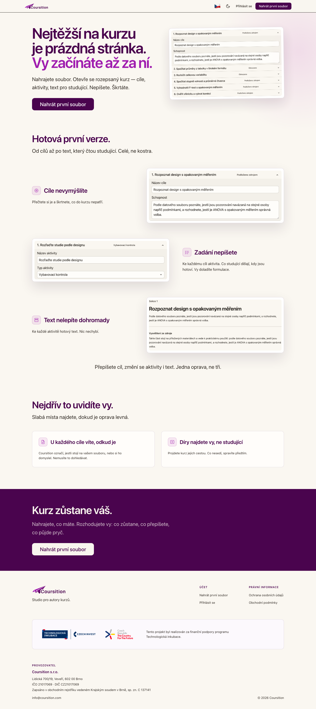
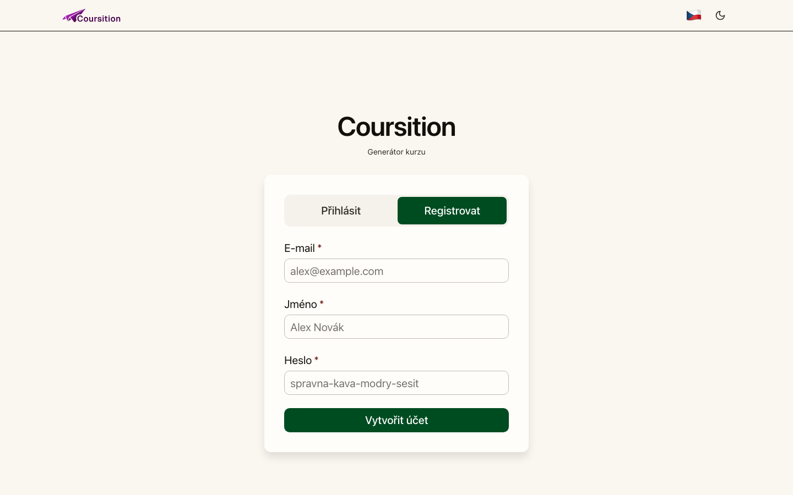
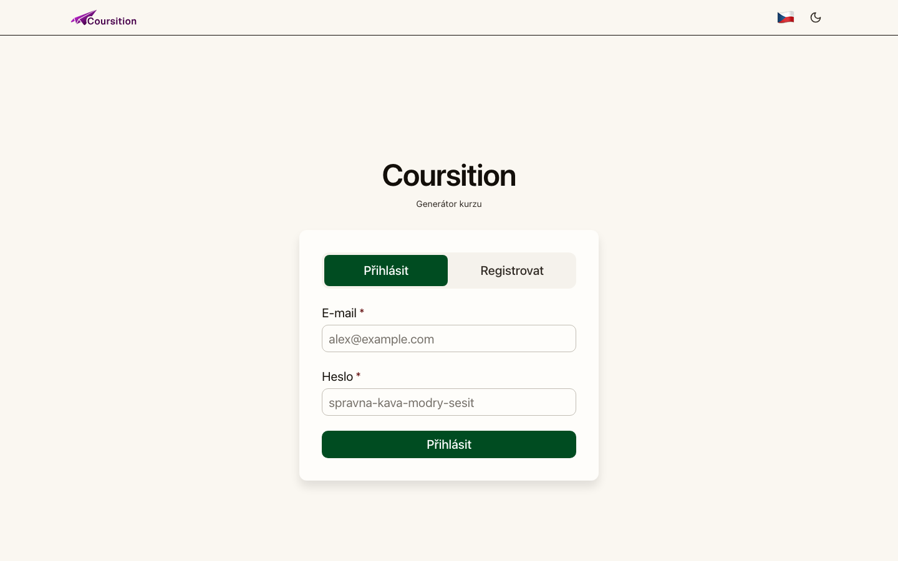
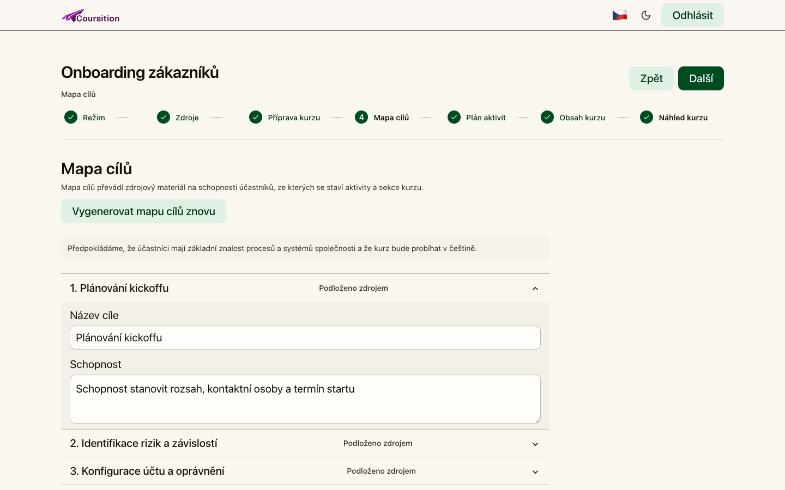
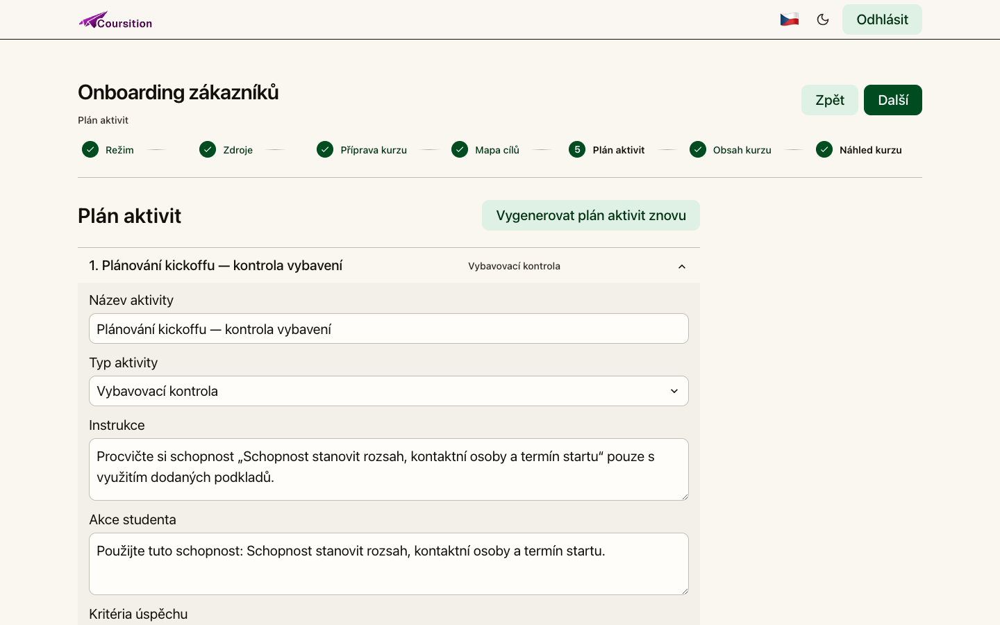
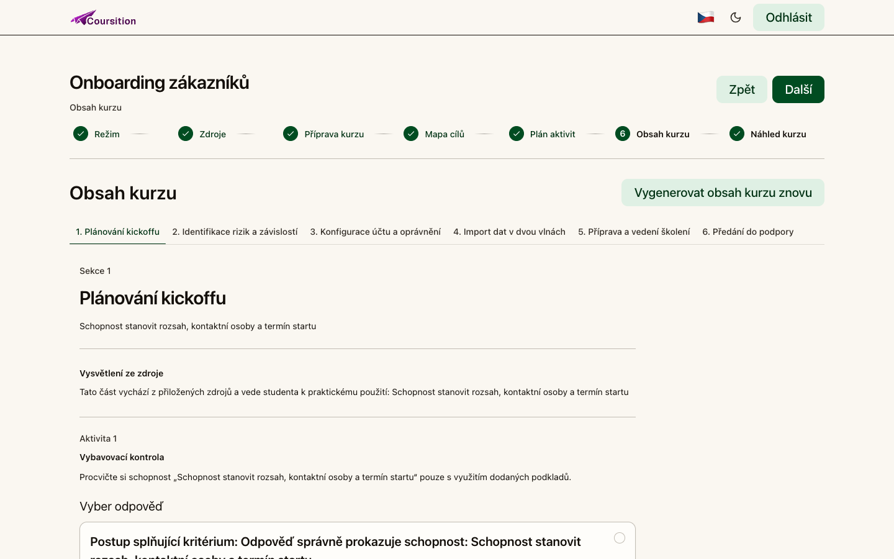
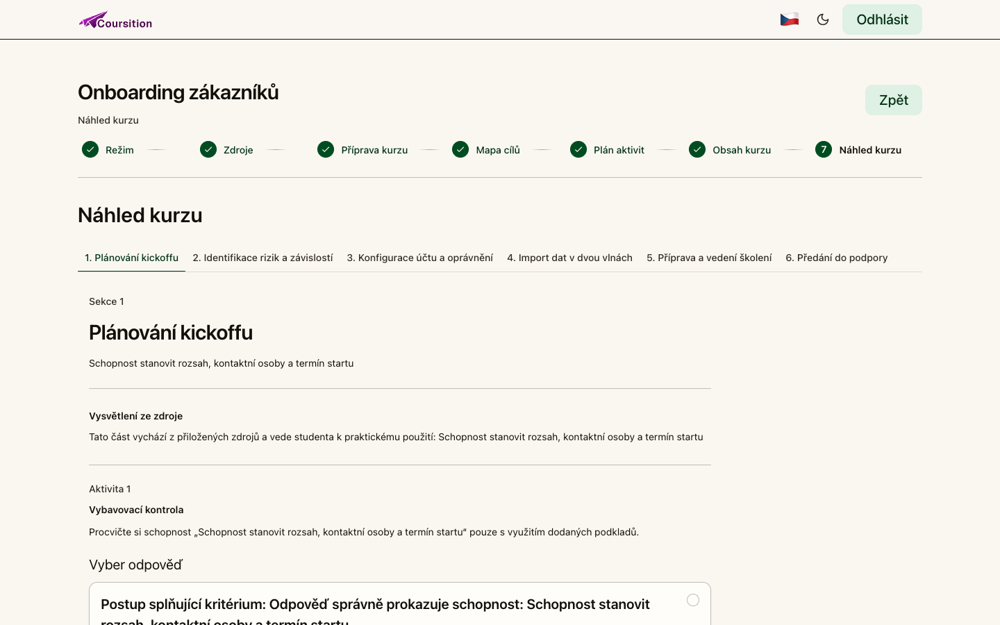
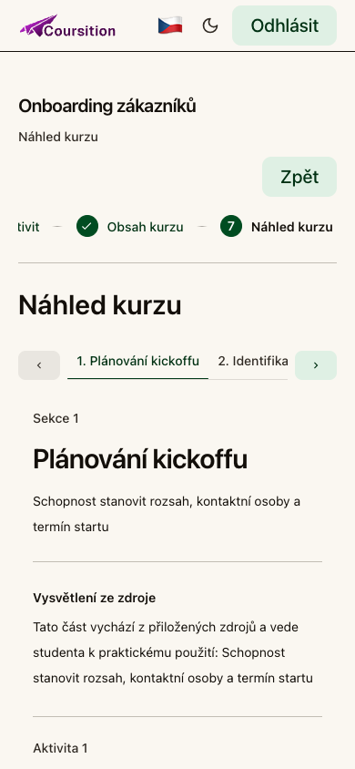

# Metodika pro uživatele

**Dokument:** Metodika pro uživatele  
**Produkt:** Coursition  
**Verze dokumentu:** 1.0  
**Datum:** 27. 7. 2026  
**Platí pro revizi aplikace:** pracovní stav repozitáře k 4. 8. 2026  
**Stav ověření:** ověřeno na lokálně sestavené aplikaci (produkční sestavení, localhost)

## 1. Účel metodiky

Tato metodika je určena autorům kurzů, kteří chtějí v Coursition připravit návrh kurzu ze svých podkladů. Nepředpokládá technické znalosti. Vysvětluje práci s účtem, založení a správu kurzu, přidání zdrojů, kontrolu vygenerovaných návrhů, úpravy přípravy, cílů a aktivit, regeneraci obsahu i závěrečnou kontrolu v náhledu.

Coursition pomáhá převést poznámky, webovou adresu nebo soubor na strukturovaný návrh kurzu. Návrh postupně obsahuje:

1. nastavení způsobu tvorby,
2. zdrojové materiály,
3. přípravu kurzu,
4. mapu vzdělávacích cílů,
5. plán aktivit,
6. obsah kurzu,
7. náhled kurzu.

Výstup vytvořený pomocí AI není automaticky správný ani připravený k použití bez kontroly. Autor kurzu odpovídá za ověření faktů, vhodnost formulací, použitelnost aktivit, oprávnění ke zdrojovým materiálům a za konečné rozhodnutí, co v kurzu zůstane.

### 1.1 Co potřebujete před zahájením práce

Připravte si:

- moderní webový prohlížeč,
- e-mailovou adresu a vlastní heslo,
- pracovní název kurzu,
- podklady, které smíte pro tvorbu kurzu použít,
- představu o cílovém publiku a výsledku učení,
- čas na věcnou a jazykovou kontrolu vygenerovaného návrhu.

Pokud pracujete s důvěrnými, osobními nebo jinak citlivými informacemi, nejprve si ověřte, zda je smíte do daného nasazení Coursition vložit. Některé druhy zdrojů mohou být podle konfigurace zpracovávány externími službami.

## 2. Orientace v Coursition

Coursition je studio pro autory kurzů. Po přihlášení pracujete na **nástěnce**, kde zakládáte kurzy a vracíte se k rozpracovaným návrhům. Uvnitř každého kurzu je sedm navazujících kroků:

**Režim → Zdroje → Příprava kurzu → Mapa cílů → Plán aktivit → Obsah kurzu → Náhled kurzu**

Každý krok má vlastní adresu a položku v horní navigaci. K předchozímu kroku se můžete vrátit tlačítkem **„Zpět“** nebo přímo přes navigaci. Tlačítko **„Další“** uloží potřebné změny a podle stavu kurzu buď otevře další krok, nebo spustí chybějící generování.

_Obr. 1: Úvodní stránka Coursition v českém rozhraní._

### 2.1 Jazyk a zařízení

Rozhraní lze používat česky nebo anglicky. Přepnutí jazyka mění jazyk ovládacích prvků a adresu stránky. Již uložený obsah kurzu se tím automaticky nepřekládá. Pokud jste například vytvořili obsah v češtině a přepnete rozhraní do angličtiny, ovládání může být anglické, ale obsah kurzu zůstane český.

Coursition lze používat na počítači i na mobilním zařízení. Pro rozsáhlejší úpravy textů je praktičtější počítač. Mobilní zobrazení je vhodné zejména pro kontrolu, návrat ke kurzu a průchod náhledem.

### 2.2 Adresy jednotlivých kroků

Adresa českého kurzu má podobu `/cs/tvorba-kurzu/ID_KURZU/...`. Poslední část označuje aktuální krok:

| Krok           | Poslední část adresy |
| -------------- | -------------------- |
| Režim          | `rezim`              |
| Zdroje         | `zdroje`             |
| Příprava kurzu | `priprava`           |
| Mapa cílů      | `cile`               |
| Plán aktivit   | `plan-aktivit`       |
| Obsah kurzu    | `obsah-kurzu`        |
| Náhled kurzu   | `nahled`             |

Přímý odkaz je užitečný pro návrat ke konkrétnímu kroku. Pokud ale některý předchozí krok není dokončený nebo jsou navazující výstupy zastaralé, aplikace může vyžadovat nejprve doplnění či nové vygenerování potřebných částí.

## 3. Účet, registrace a přihlášení

### 3.1 Registrace nového účtu

1. Otevřete stránku **„Registrovat“**.
2. Do pole **„E-mail“** zadejte adresu, kterou budete používat pro přihlášení.
3. Do pole **„Jméno“** zadejte své jméno.
4. Zvolte heslo o délce nejméně 8 znaků.
5. Stiskněte **„Vytvořit účet“**.
6. Po úspěšné registraci se otevře nástěnka.

_Obr. 2: Registrace nového uživatelského účtu._

Použijte jedinečné, dostatečně dlouhé heslo, které nepoužíváte u jiné služby. Přístup ke kurzu je vázán na zadaný e-mail a heslo. V aktuálním rozhraní není k dispozici samoobslužné obnovení zapomenutého hesla. Pokud přístup ztratíte, obraťte se na provozovatele konkrétního nasazení Coursition.

### 3.2 Přihlášení

1. Otevřete stránku **„Přihlásit se“**.
2. Zadejte e-mail použitý při registraci.
3. Zadejte heslo.
4. Stiskněte **„Přihlásit se“**.
5. Po úspěšném přihlášení se otevře nástěnka s vašimi kurzy.

_Obr. 3: Přihlášení do Coursition._

Pokud bez přihlášení otevřete nástěnku nebo adresu konkrétního kurzu, aplikace vás přesměruje na přihlášení. Po přihlášení otevřete požadovaný kurz z nástěnky tlačítkem **„Pokračovat“**.

### 3.3 Odhlášení

1. Před odhlášením zkontrolujte, že aplikace zobrazuje stav **„Všechny změny jsou uložené.“**
2. V horní části stránky stiskněte **„Odhlásit“**.
3. Aplikace ukončí přihlášenou relaci a vrátí vás na přihlašovací stránku.

Odhlášení nemaže uložené kurzy. Po novém přihlášení stejným účtem je znovu najdete na nástěnce.

## 4. Nástěnka a životní cyklus kurzu

Nástěnka je výchozí místo pro správu kurzů. Obsahuje seznam uložených kurzů a formulář pro založení nového kurzu. Některá lokální nebo demonstrační nasazení mohou předem obsahovat položky označené **„Ukázkový kurz“**; produkční Cloudflare nasazení se samo ukázkovými kurzy neplní. Ukázkovou položku můžete otevřít přes **„Upravit“** nebo odstranit stejně jako jiný kurz.

### 4.1 Založení nového kurzu

1. Na nástěnce najděte pole **„Název kurzu“**.
2. Zadejte pracovní název, například „Bezpečné předávání zákaznických dat“.
3. Stiskněte **„Vytvořit kurz“**.
4. Otevře se první krok **„Režim“**.

Název můžete chápat jako pracovní označení návrhu. Volte jej tak, abyste kurz později snadno poznali mezi ostatními položkami na nástěnce.

### 4.2 Návrat k rozpracovanému kurzu

1. Přihlaste se a otevřete nástěnku.
2. Najděte požadovaný kurz.
3. Zkontrolujte souhrn aktuálního stavu, například poslední krok, počet zdrojů, aktivit a částí obsahu.
4. Stiskněte akci pro otevření kurzu, která se podle stavu rozhraní může zobrazit jako **„Pokračovat“** nebo **„Upravit“**.
5. Aplikace otevře uložený návrh v odpovídajícím kroku.

Uložený kurz zůstává dostupný po obnovení stránky, odhlášení a novém přihlášení. Při přihlášení ke stejnému nasazení Coursition stejným účtem jej lze otevřít také na jiném zařízení.

### 4.3 Smazání kurzu

Smazání kurzu je nevratné.

1. Na nástěnce najděte kurz, který opravdu chcete odstranit.
2. Stiskněte **„Smazat“**.
3. Zobrazí se dialog **„Potvrdit smazání“** s upozorněním: **„Tuto akci nelze vzít zpět. Opravdu chceš pokračovat?“**
4. Pokud si nejste jistí, dialog zrušte.
5. Potvrďte pouze tehdy, pokud už návrh ani jeho zdroje nepotřebujete.

Před smazáním si mimo Coursition uložte texty nebo podklady, které budete chtít dále používat. Nespoléhejte na možnost obnovení smazaného kurzu.

## 5. Volba režimu tvorby

Po založení kurzu vyberete způsob práce.

### 5.1 „Vygeneruj kurz za mě“

Tento režim použijte, když chcete po vložení zdrojů nechat vygenerovat celý navazující návrh. Po dokončení zdrojů a pokračování aplikace postupně připraví cíle, aktivity, obsah a náhled.

Režim je vhodný pro rychlý první návrh. Neznamená však, že lze přeskočit kontrolu. Po vygenerování projděte všechny kroky a upravte nepřesné, příliš obecné nebo nevhodné části.

### 5.2 „Pomoz mi kurz sestavit“

Tento režim použijte, když chcete procházet jednotlivé kroky postupně. Máte větší prostor průběžně kontrolovat přípravu, mapu cílů a plán aktivit před vytvořením navazujícího obsahu.

Je vhodný zejména tehdy, když:

- potřebujete přesně řídit cílové publikum a výsledek učení,
- jsou podklady nejednoznačné,
- chcete cíle nebo aktivity významně upravovat,
- je důležitá důsledná odborná kontrola před generováním dalších částí.

### 5.3 Jak režim zvolit

| Potřeba                                                       | Doporučený režim         |
| ------------------------------------------------------------- | ------------------------ |
| Rychle získat celý první návrh                                | „Vygeneruj kurz za mě“   |
| Kontrolovat každý krok před pokračováním                      | „Pomoz mi kurz sestavit“ |
| Málo času na první verzi, ale dost času na následnou kontrolu | „Vygeneruj kurz za mě“   |
| Citlivé nebo odborně náročné téma                             | „Pomoz mi kurz sestavit“ |

V obou režimech platí, že konečný obsah musí posoudit člověk.

## 6. Přidání a správa zdrojů

Krok **„Zdroje“** určuje, z čeho má návrh kurzu vycházet. K dispozici jsou tři záložky: **„Poznámky“**, **„URL“** a **„Soubor“**.

Přidejte jen materiály, které souvisejí s tématem kurzu. Větší množství nesourodých podkladů může vést k méně soustředěnému návrhu.

### 6.1 Poznámky

Poznámky jsou nejpřímější způsob, jak do kurzu vložit vlastní text.

1. Otevřete záložku **„Poznámky“**.
2. Zadejte název zdroje.
3. Vložte text poznámek.
4. Potvrďte přidání zdroje.
5. Po zpracování se u zdroje zobrazí stav **„Zpracováno“**.
6. Pomocí **„Zobrazit náhled“** ověřte, že byl vložen správný text.

Do poznámek je vhodné vložit například osnovu, interně schválený postup, výklad pojmů nebo přepis materiálu, který smíte použít.

### 6.2 URL

Záložka **„URL“** slouží pro veřejně dostupnou webovou stránku.

1. Otevřete záložku **„URL“**.
2. Vyplňte **„Název zdroje“**.
3. Do pole **„URL“** vložte úplnou adresu začínající `http://` nebo `https://`.
4. Potvrďte přidání.
5. Po zpracování otevřete náhled zdroje a ověřte, zda obsah odpovídá zamýšlené stránce.

Prohlížeč může chybný formát adresy odmítnout ještě před odesláním. Úspěšné načtení URL závisí také na dostupnosti stránky a konfiguraci služby pro získávání webového obsahu. Stránka za přihlášením, blokovaná stránka nebo dynamický web nemusí být zpracovány správně.

Nepoužívejte odkaz jen podle názvu. Vždy zkontrolujte náhled načteného textu, protože webová stránka se může změnit nebo může obsahovat více témat.

### 6.3 Soubor

1. Otevřete záložku **„Soubor“**.
2. Zadejte název zdroje.
3. Vyberte soubor ze zařízení.
4. Potvrďte přidání.
5. Počkejte na zpracování.
6. Otevřete náhled a zkontrolujte rozpoznaný obsah.

Maximální velikost jednoho souboru je **10 MiB**. Zpracování podporuje textové materiály a podle konfigurace nasazení také běžné kancelářské dokumenty. Zpracování obrázků, zvuku nebo videa závisí na tom, zda má provozovatel nastavené potřebné externí služby. Samotná možnost soubor vybrat není zárukou, že jeho obsah bude podporován.

Pokud je důležitá přesná struktura tabulek, grafiky nebo složité sazby, porovnejte náhled zpracovaného textu s originálem. Převod do textu může část vizuálního významu ztratit.

### 6.4 Rozepsané údaje při přepínání záložek

Každá záložka zdroje si drží vlastní rozepsané údaje. Můžete tedy přejít například z poznámek na URL a poté se vrátit, aniž by se rozepsaný text jiné záložky automaticky vymazal. Po úspěšném odeslání se vyčistí odeslaný formulář.

I tak je bezpečnější delší původní text uchovávat také ve vlastním dokumentu mimo aplikaci.

### 6.5 Stavy zdroje a doporučená reakce

| Stav              | Co znamená pro uživatele                                  | Co udělat                                                                   |
| ----------------- | --------------------------------------------------------- | --------------------------------------------------------------------------- |
| **Zpracováno**    | Obsah je připravený pro použití při tvorbě kurzu.         | Otevřete náhled a ověřte správnost.                                         |
| **Částečné**      | Podařilo se získat jen část obsahu.                       | Zkontrolujte náhled; chybějící část doplňte poznámkami nebo jiným souborem. |
| **Selhalo**       | Zdroj se nepodařilo zpracovat.                            | Zkontrolujte URL nebo soubor a použijte opakování zpracování.               |
| **Nepodporováno** | Typ nebo obsah zdroje nelze v dané konfiguraci zpracovat. | Převeďte obsah do textové podoby nebo jej vložte jako poznámky.             |
| **Smazáno**       | Zdroj už není součástí návrhu kurzu.                      | Pokud byl odstraněn omylem, přidejte jej znovu z původního podkladu.        |

V interním průběhu mohou existovat také přechodné stavy, například čekání nebo zpracování. Pokud se stav dlouho nemění, obnovte stránku. Jestliže problém přetrvá, kontaktujte provozovatele.

### 6.6 Náhled, opakování a smazání zdroje

- **„Zobrazit náhled“** otevře text, který bude použit jako podklad.
- **„Skrýt náhled“** náhled zavře.
- U neúspěšného nebo nepodporovaného zdroje může být dostupná akce pro nové zpracování.
- **„Smazat“** odstraní zdroj z návrhu.

Při opakování zpracování souboru musí být původní obsah ještě dostupný. Pokud opakování nefunguje, přidejte soubor znovu jako nový zdroj.

Přidání, nové zpracování nebo smazání zdroje mění podklady kurzu. Již vygenerované cíle, aktivity nebo obsah proto mohou být označeny jako **„Zastaralé“** a bude nutné je znovu vygenerovat.

## 7. Příprava kurzu

V kroku **„Příprava kurzu“** určíte, pro koho kurz je a k čemu má vést. Dobře vyplněná příprava výrazně usnadní kontrolu dalších částí.

### 7.1 Základní pole

| Pole                    | Jak je vyplnit                                                  |
| ----------------------- | --------------------------------------------------------------- |
| **Výsledek učení**      | Popište, co má účastník po kurzu prokazatelně umět nebo udělat. |
| **Cílové publikum**     | Uveďte konkrétní skupinu, roli nebo úroveň zkušeností.          |
| **Styl praxe**          | Určete, jak mají účastníci znalosti procvičovat.                |
| **Jazyk výstupu kurzu** | Vyberte češtinu, angličtinu nebo stejný jazyk jako zdroj.       |

Výsledek učení formulujte jako pozorovatelnou schopnost. Místo „porozumět bezpečnosti“ použijte například „rozpoznat rizikový způsob předání dat a zvolit schválený postup“.

### 7.2 Další nastavení

V rozbalené části **„Další nastavení“** můžete upřesnit:

- **Vstupní znalosti** – co už má účastník znát,
- **Hloubku kurzu** – jak podrobně se má téma zpracovat,
- co se má v návrhu vynechat nebo čemu se má vyhnout,
- zda se mají používat jen tvrzení podložená zdroji.

Volba **„Používat jen tvrzení podložená zdroji“** zpřísňuje požadavek na vazbu ke zdrojům. Není však zárukou faktické bezchybnosti. Vygenerovaná tvrzení stále porovnejte s původními materiály.

### 7.3 Kontrolní otázky před pokračováním

Před stisknutím **„Další“** si odpovězte:

- Je cílové publikum dost konkrétní?
- Lze výsledek učení skutečně pozorovat nebo ověřit?
- Odpovídá zvolená hloubka času a zkušenostem účastníků?
- Je jazyk výstupu správný?
- Nejsou požadavky v rozporu se zdrojovými materiály?

## 8. Mapa cílů

**Mapa cílů** převádí zdroje a přípravu kurzu na konkrétní schopnosti účastníků. Každý cíl je upravitelný.

_Obr. 4: Ilustrační ukázkový kurz v editoru Mapy cílů._

### 8.1 Co u každého cíle kontrolovat

1. **Název cíle** – je stručný a srozumitelný?
2. **Schopnost** – popisuje pozorovatelnou činnost účastníka?
3. **Vazba na kurz** – pomáhá cíl dosáhnout hlavního výsledku učení?
4. **Opora ve zdroji** – odpovídá tvrzení skutečným podkladům?
5. **Přiměřenost** – není cíl příliš široký pro jednu část kurzu?

Upravte text přímo v příslušných polích. Během ukládání sledujte stav v rozhraní.

### 8.2 Jak číst označení původu

U cílů se mohou zobrazovat označení jako:

- **„Podloženo zdrojem“** – cíl má deklarovanou oporu ve zdroji,
- **„Částečně podloženo zdrojem“** – opora je pouze částečná,
- **„Odvozeno“** – návrh byl z podkladů odvozen a vyžaduje zvýšenou kontrolu,
- **„Doplněno autorem“** – obsah vložil autor.

Ani označení **„Podloženo zdrojem“** není důkazem, že je formulace bezchybná. Otevřete zdroj a porovnejte význam, podmínky a případné výjimky.

### 8.3 Nové vygenerování mapy cílů

Tlačítko **„Vygenerovat mapu cílů znovu“** použijte, když:

- jste významně změnili zdroje nebo přípravu,
- cíle nepokrývají zamýšlený výsledek,
- cíle jsou příliš obecné nebo se opakují.

Nové generování může změnit strukturu i formulace. Pokud potřebujete zachovat část původního znění, zkopírujte si ji předem do vlastního pracovního dokumentu.

## 9. Plán aktivit

**Plán aktivit** určuje, co bude studující v jednotlivých částech kurzu dělat. Každé zadání aktivity lze rozbalit a upravit.

_Obr. 5: Ilustrační ukázkový kurz v editoru Plánu aktivit._

### 9.1 Upravovaná pole

U aktivity kontrolujte zejména:

- název aktivity,
- **Typ aktivity**,
- **Instrukce**,
- **Akce studenta**,
- **Kritéria úspěchu**,
- **Vedení zpětné vazby**.

Instrukce musí být proveditelná bez informací, které účastník nemá. Kritéria úspěchu musí být konkrétní; neurčité formulace jako „odpověď je kvalitní“ nahraďte pozorovatelnými znaky správné odpovědi.

### 9.2 Podporované typy aktivit

| Typ aktivity              | K čemu se hodí                                               | Co zkontrolovat                                                |
| ------------------------- | ------------------------------------------------------------ | -------------------------------------------------------------- |
| **Vybavovací kontrola**   | Rychlé ověření, zda si účastník vybaví podstatnou informaci. | Jednoznačnost otázky a správné odpovědi.                       |
| **Rozhodnutí ve scénáři** | Volba postupu v konkrétní situaci.                           | Realističnost scénáře a důsledků voleb.                        |
| **Řazení / přiřazování**  | Seřazení kroků nebo spojení souvisejících položek.           | Zda existuje jednoznačné pořadí či vazba.                      |
| **Praktický úkol**        | Samostatné použití postupu nebo znalosti.                    | Proveditelnost zadání a srozumitelná kritéria sebekontroly.    |
| **Odpověď podle rubriky** | Otevřená odpověď hodnocená podle více kritérií.              | Kvalitu rubriky a dostupnost AI zpětné vazby v daném nasazení. |

### 9.3 Kontrola navržených aktivit

U každé aktivity ověřte:

1. že přímo podporuje konkrétní vzdělávací cíl,
2. že účastník dostal všechny potřebné informace,
3. že zadání nevyžaduje nástroj nebo oprávnění, které účastník nemá,
4. že lze poznat úspěšné splnění,
5. že zpětná vazba neprozrazuje řešení předčasně,
6. že příklad neobsahuje skutečné osobní nebo důvěrné údaje.

Tlačítko **„Vygenerovat plán aktivit znovu“** použijte, pokud se změnily cíle nebo pokud navržené aktivity nejsou použitelné. Po regeneraci znovu projděte všechny položky; nový výsledek nemusí zachovat vaše dřívější formulace.

## 10. Obsah kurzu

Krok **„Obsah kurzu“** skládá cíle, vysvětlení a aktivity do sekcí. Sekce lze přepínat pomocí záložek.

_Obr. 6: Ilustrační ukázkový kurz v editoru Obsahu kurzu._

### 10.1 Co v obsahu kontrolovat

Projíždějte sekci po sekci a kontrolujte:

- název sekce,
- popis schopnosti nebo cíle,
- vysvětlení vycházející ze zdroje,
- návaznost aktivity na výklad,
- pořadí jednotlivých částí,
- srozumitelnost pro cílové publikum,
- správnost odborných tvrzení.

Krok **„Obsah kurzu“** je v současné aplikaci pouze pro čtení a regeneraci. Text sekcí v něm nelze přímo editovat ani automaticky ukládat. Pokud najdete chybu, vraťte se podle jejího původu do **Přípravy kurzu**, **Mapy cílů** nebo **Plánu aktivit**, upravte vstup a následně obsah znovu vygenerujte.

### 10.2 Kdy obsah vygenerovat znovu

Tlačítko **„Vygenerovat obsah kurzu znovu“** použijte zejména tehdy, když:

- jste změnili mapu cílů nebo plán aktivit,
- obsah nezohledňuje nové zdroje,
- sekce jsou špatně uspořádané,
- formulace nebo struktura neodpovídají cílovému publiku.

Regenerace vytvoří novou variantu a může změnit i části, se kterými jste byli spokojeni. Potřebujete-li uchovat konkrétní znění pro porovnání, zkopírujte si je předem do vlastního pracovního dokumentu.

## 11. Náhled kurzu a kontrola kvality

**Náhled kurzu** ukazuje kurz z pohledu studujícího. Je to hlavní místo pro závěrečnou kontrolu před dalším použitím návrhu.

_Obr. 7: Ilustrační ukázkový kurz v Náhledu kurzu na počítači._

### 11.1 Průchod náhledem

1. Otevřete **„Náhled kurzu“**.
2. Projděte všechny záložky sekcí ve správném pořadí.
3. Přečtěte text jako člověk, který neviděl původní podklady.
4. Vyzkoušejte každou aktivitu.
5. U uzavřených aktivit použijte **„Zkontrolovat odpověď“**.
6. U praktického úkolu nebo odpovědi podle rubriky může být dostupná akce **„Získat zpětnou vazbu AI“**.
7. Zapište si chyby a vraťte se do příslušného kroku k opravě.
8. Po opravě znovu otevřete náhled a celý dotčený úsek zopakujte.

Náhled v současné aplikaci neslouží k publikování, sdílení ani stažení hotového kurzu. Neobsahuje samostatné akce **„Obnovit náhled“**, **„Sdílet“** ani **„Stáhnout“**. Po změně vstupů nejprve regenerujte zastaralé části a poté otevřete krok **„Náhled kurzu“** znovu.

### 11.2 Kontrola zjištění kvality

Ve spodní části náhledu je sekce **„Kontrola“**. Pokud obsahuje zjištění:

1. přečtěte jejich závažnost a popis;
2. u blokujícího zjištění se vraťte do uvedeného kroku a opravte příčinu;
3. po opravě a regeneraci označte zjištění **„Vyřešit“**;
4. akci **„Zahodit“** použijte pouze tehdy, když jste vědomě ověřili, že zjištění pro tento kurz neplatí.

Blokující zjištění může zabránit pokračování, dokud není vyřešeno nebo vědomě zamítnuto. Samotné označení zjištění jako vyřešené neopravuje obsah.

_Obr. 8: Ilustrační ukázkový kurz v mobilním Náhledu kurzu._

### 11.3 Zpětná vazba AI

Zpětná vazba AI je určena jako pomoc při posouzení otevřené odpovědi. Je dostupná jen tehdy, když je v daném nasazení nakonfigurována potřebná AI služba. Může selhat nebo vrátit nepřesné hodnocení.

Proto:

- nepoužívejte AI hodnocení jako jediný podklad pro důležité rozhodnutí,
- ověřte, že rubrika skutečně měří zamýšlenou schopnost,
- zkontrolujte, zda zpětná vazba neodporuje zdroji,
- nepovažujte číselné skóre za objektivní jen proto, že jej vytvořil systém,
- u citlivého vzdělávání zajistěte lidskou kontrolu výsledků.

### 11.4 Aktivita bez interakce

Pokud se některou aktivitu nepodaří vytvořit v použitelné interaktivní podobě, označí ji aplikace jako **„Bez interakce“**. Takovou aktivitu nepovažujte za hotovou.

Postup:

1. Vraťte se do **„Plánu aktivit“**.
2. Zkontrolujte typ, instrukci a kritéria aktivity.
3. Formulaci zpřesněte nebo změňte typ aktivity.
4. Vygenerujte navazující výstup znovu.
5. Aktivitu znovu vyzkoušejte v náhledu.

### 11.5 Povinný kontrolní seznam autora

Před tím, než návrh použijete pro výuku nebo předáte další osobě, ověřte:

#### Věcná správnost

- [ ] Každé odborné tvrzení odpovídá platnému zdroji.
- [ ] Nechybí důležité podmínky, omezení nebo výjimky.
- [ ] Obsah nepracuje se zastaralou verzí postupu.
- [ ] Odvozená tvrzení jsou označena a zvlášť ověřena.

#### Vhodnost pro publikum

- [ ] Jazyk odpovídá zkušenostem účastníků.
- [ ] Neznámé pojmy jsou vysvětleny.
- [ ] Rozsah odpovídá dostupnému času.
- [ ] Příklady jsou pro cílovou skupinu srozumitelné.

#### Aktivity

- [ ] Každá aktivita podporuje konkrétní cíl.
- [ ] Zadání lze splnit s dostupnými informacemi.
- [ ] Správné řešení a kritéria nejsou v rozporu se zdrojem.
- [ ] Všechny interakce byly skutečně vyzkoušeny.
- [ ] V kurzu nezůstala aktivita označená „Bez interakce“.

#### Jazyk a bezpečnost

- [ ] Text neobsahuje osobní údaje vložené omylem.
- [ ] Příklady neodhalují důvěrné interní informace.
- [ ] Autor má právo použít vložené podklady.
- [ ] Text prošel jazykovou a stylistickou kontrolou.

## 12. Ukládání, změny a zastaralé části

### 12.1 Automatické ukládání

Při úpravách aplikace zobrazuje stav:

- **„Ukládám změny…“** – změna se právě zapisuje,
- **„Všechny změny jsou uložené.“** – aplikace potvrdila uložení.

Před odchodem ze stránky, obnovením prohlížeče nebo odhlášením vždy počkejte na potvrzení **„Všechny změny jsou uložené.“** Pokud stav zůstává dlouho na ukládání, nepokračujte dalšími rychlými změnami; nejprve ověřte připojení a případně stránku obnovte.

### 12.2 Co znamená „Zastaralé“

Kurz má navazující strukturu. Když změníte dřívější krok, pozdější výstup už nemusí odpovídat novému zadání. Aplikace jej proto označí jako **„Zastaralé“**.

Příklad:

1. V Mapě cílů změníte schopnost účastníka.
2. Stará aktivita a obsah byly vytvořeny podle původního cíle.
3. Plán aktivit, obsah a náhled se označí jako zastaralé.
4. Tyto kroky mohou být dočasně nedostupné.
5. Tlačítkem **„Další“** nebo příslušnou akcí spustíte nové generování.
6. Po dokončení zkontrolujete nový plán, obsah i náhled.

Označení „Zastaralé“ není chyba ukládání. Je to upozornění, že se změnil vstup, ze kterého byla pozdější část vytvořena.

### 12.3 Kdy raději upravit a kdy regenerovat

| Situace                                      | Doporučený postup                                                                           |
| -------------------------------------------- | ------------------------------------------------------------------------------------------- |
| Překlep nebo jedna nepřesná věta v obsahu    | Opravit její zdroj v Přípravě, Mapě cílů nebo Plánu aktivit a regenerovat navazující části. |
| Jeden špatně formulovaný cíl                 | Upravit cíl a znovu vytvořit dotčené navazující části.                                      |
| Nový nebo odstraněný zdroj mění význam kurzu | Regenerovat mapu cílů a další navazující kroky.                                             |
| Nevhodná struktura většiny aktivit           | Regenerovat plán aktivit.                                                                   |
| Jedna aktivita nemá použitelnou interakci    | Nejprve zpřesnit její zadání; poté regenerovat navazující výstup.                           |
| Většina obsahu neodpovídá cílovému publiku   | Upravit Přípravu kurzu a regenerovat navazující části.                                      |

Po každé regeneraci proveďte novou lidskou kontrolu. Regenerace není oprava se zaručeným výsledkem; vytváří novou variantu návrhu.

## 13. Práce s daty, autorská práva a soukromí

### 13.1 Používejte jen oprávněné podklady

Do Coursition vkládejte pouze materiály, které smíte použít pro tvorbu kurzu. Může jít o vlastní texty, interní materiály schválené k danému účelu nebo veřejné zdroje použité v souladu s jejich licencí a právními podmínkami.

Samotná veřejná dostupnost webové stránky neznamená automaticky právo její obsah kopírovat, upravovat nebo dále šířit. Před použitím cizího obsahu ověřte licenční podmínky a podle potřeby uveďte zdroj.

### 13.2 Osobní a citlivé údaje

Nevkládejte osobní, důvěrné nebo citlivé údaje, pokud k tomu nemáte právní důvod, oprávnění a schválený postup. Pro demonstrační příklady používejte smyšlená nebo anonymizovaná data.

Zvláštní opatrnost věnujte:

- osobním údajům zákazníků a zaměstnanců,
- zdravotním, finančním nebo jinak citlivým informacím,
- přístupovým údajům, heslům a tajným klíčům,
- neveřejným smlouvám, obchodním plánům a interním incidentům,
- materiálům omezeným licencí nebo mlčenlivostí.

### 13.3 Externí zpracování

Podle konfigurace mohou být některé podklady odeslány externím službám, například kvůli získání obsahu webové stránky, převodu dokumentu, přepisu zvuku nebo vytvoření a hodnocení obsahu pomocí AI. Coursition samo v uživatelském rozhraní negarantuje pravidla uchování dat těchto poskytovatelů.

Pokud materiál nesmíte sdílet s externí službou, nevkládejte jej bez předchozího souhlasu odpovědné osoby a provozovatele Coursition.

Aktuální texty pro uživatele najdete na stránkách:

- `/cs/ochrana-osobnich-udaju`,
- `/cs/obchodni-podminky`.

Tyto stránky jsou informačním podkladem; tato metodika nenahrazuje právní posouzení konkrétního použití.

## 14. Řešení potíží

| Pozorovaný problém                         | Pravděpodobná situace                                                              | Doporučený postup                                                                                                 |
| ------------------------------------------ | ---------------------------------------------------------------------------------- | ----------------------------------------------------------------------------------------------------------------- |
| Po otevření kurzu se zobrazí přihlášení    | Relace skončila nebo nejste přihlášeni.                                            | Přihlaste se znovu a otevřete kurz na nástěnce přes „Pokračovat“.                                                 |
| Nelze vytvořit účet                        | Některé povinné pole je chybné, heslo je příliš krátké nebo je e-mail již použitý. | Zkontrolujte jméno, formát e-mailu a heslo o nejméně 8 znacích.                                                   |
| Neplatnou URL nelze odeslat                | Adresa nemá platný formát.                                                         | Vložte úplnou adresu včetně `https://` a odstraňte mezery.                                                        |
| URL je ve stavu „Selhalo“                  | Stránka není dostupná nebo ji nelze získat přes nastavenou službu.                 | Ověřte stránku v nové kartě, zkuste nové zpracování nebo vložte potřebný text jako poznámky.                      |
| Soubor je „Nepodporováno“                  | Typ či obsah souboru dané nasazení neumí zpracovat.                                | Převeďte obsah do textové podoby nebo jej vložte jako poznámky.                                                   |
| Soubor je příliš velký                     | Překračuje limit 10 MiB.                                                           | Rozdělte jej na menší části nebo vložte jen relevantní text.                                                      |
| Náhled zdroje je prázdný nebo neúplný      | Převod nezískal celý obsah.                                                        | Porovnejte s originálem; chybějící část doplňte poznámkami.                                                       |
| Tlačítko dalšího kroku není dostupné       | Chybí povinný údaj nebo předchozí krok není připraven.                             | Projděte zvýrazněná pole a stav zdrojů; dokončete požadovaný krok.                                                |
| Pozdější kroky jsou „Zastaralé“            | Změnil se zdroj, příprava nebo cíl.                                                | Spusťte nové generování od nejbližšího zastaralého kroku a výsledek znovu zkontrolujte.                           |
| Generování skončí chybou                   | AI služba není dostupná, není nastavena nebo nevrátila platný výsledek.            | Použijte dostupnou akci pro opakování. Pokud se chyba opakuje, kontaktujte provozovatele.                         |
| Aktivita je „Bez interakce“                | Nepodařilo se vytvořit použitelnou interaktivní podobu.                            | Upravte zadání nebo typ aktivity, regenerujte a znovu ji vyzkoušejte.                                             |
| „Získat zpětnou vazbu AI“ nefunguje        | AI hodnocení není nakonfigurováno nebo služba selhala.                             | Zkontrolujte odpověď ručně podle rubriky a informujte provozovatele.                                              |
| Náhled neobsahuje „Sdílet“ nebo „Stáhnout“ | Tyto publikační akce nejsou součástí současné aplikace.                            | Kurz zkontrolujte v interním náhledu; způsob předání nebo publikace řešte mimo popsaný workflow s provozovatelem. |
| Blokující zjištění nepovolí pokračovat     | Kontrola kvality eviduje nevyřešený problém.                                       | Vraťte se do uvedeného kroku, opravte příčinu, regenerujte navazující části a teprve potom použijte „Vyřešit“.    |
| Stav zůstává „Ukládám změny…“              | Ukládání se nedokončilo nebo je problém s připojením.                              | Vyčkejte, zkontrolujte připojení a poté obnovte stránku. Ověřte, zda se změna zachovala.                          |
| Po přihlášení nevidíte očekávaný kurz      | Použili jste jiný účet nebo jiné nasazení aplikace.                                | Ověřte e-mail účtu a adresu Coursition; poté kontaktujte provozovatele.                                           |
| Mobilní stránka se zobrazuje chybně        | Jde o problém konkrétního prohlížeče nebo zobrazení.                               | Obnovte stránku, otočte zařízení nebo použijte aktuální prohlížeč; přetrvávající chybu nahlaste.                  |

### 14.1 Co uvést při eskalaci

Coursition v popsaném stavu neposkytuje garantovanou dobu dostupnosti, samoobslužnou obnovu hesla ani obecnou veřejnou podporu s garantovanou reakční dobou. Kontaktujte osobu nebo tým, který provozuje konkrétní nasazení aplikace.

Do hlášení uveďte:

1. datum a přibližný čas problému,
2. adresu stránky bez přihlašovacích údajů,
3. název kroku, ve kterém problém nastal,
4. přesný text viditelné chyby,
5. kroky, které chybě předcházely,
6. typ prohlížeče a zařízení,
7. zda se problém opakuje po obnovení stránky a novém přihlášení,
8. snímek obrazovky bez osobních, důvěrných nebo přístupových údajů.

Nikdy neposílejte heslo, přihlašovací cookie, tajný klíč ani celý citlivý zdrojový dokument jako součást běžného hlášení.

## 15. Ukázkový průchod od začátku do konce

Následující krátký scénář ukazuje běžnou práci autora kurzu.

### 15.1 Zadání

Chcete připravit kurz „Bezpečné předávání zákaznických dat“ pro nové členy podpory. Máte schválené interní poznámky a textový soubor s pracovním postupem.

### 15.2 Postup

1. **Registrace a přihlášení**  
   Vytvoříte účet pomocí jména, e-mailu a hesla. Po registraci se otevře nástěnka.

2. **Nový kurz**  
   Do pole „Název kurzu“ zadáte „Bezpečné předávání zákaznických dat“ a stisknete „Vytvořit kurz“.

3. **Režim**  
   Pro rychlý první návrh vyberete „Vygeneruj kurz za mě“. Počítáte s tím, že celý výsledek následně projdete a upravíte.

4. **Poznámky**  
   V záložce „Poznámky“ vložíte stručný popis schváleného způsobu předání. Po zpracování otevřete náhled a zkontrolujete text.

5. **Soubor**  
   Přidáte textový soubor s detailním postupem. Počkáte na stav „Zpracováno“ a porovnáte náhled s originálem.

6. **Generování**  
   Stisknete „Další“. Aplikace začne vytvářet celý návrh a po dokončení otevře Náhled kurzu.

7. **Kontrola Mapy cílů**  
   Vrátíte se do Mapy cílů. Jeden cíl je příliš obecný, proto schopnost upravíte na „rozpoznat neschválený kanál a zvolit schválený postup předání“.

8. **Uložení a zastaralý stav**  
   Počkáte na „Všechny změny jsou uložené.“ Navazující plán, obsah a náhled se označí jako „Zastaralé“, protože byly vytvořeny podle původního cíle.

9. **Nové generování**  
   Stisknete „Další“ a necháte navazující části znovu vytvořit.

10. **Kontrola aktivit**  
    V Plánu aktivit ověříte, že scénáře neobsahují skutečná zákaznická data, možnosti jsou jednoznačné a kritéria odpovídají internímu postupu.

11. **Kontrola obsahu**  
    Projdete všechny sekce. Nepřesnou formulaci dohledáte v příslušném vstupu — například v cíli nebo zadání aktivity — upravíte ji a necháte Obsah kurzu znovu vygenerovat.

12. **Náhled**  
    Vyzkoušíte každou aktivitu, použijete „Zkontrolovat odpověď“, projdete sekci „Kontrola“ a ověříte, že v kurzu nezůstala žádná aktivita „Bez interakce“ ani nevyřešené blokující zjištění.

13. **Návrat k práci**  
    Odhlásíte se. Později se přihlásíte stejným účtem, na nástěnce vyberete kurz a stisknete „Pokračovat“. Uložený návrh se znovu otevře.

14. **Konečné rozhodnutí**  
    Před předáním kurzu ještě jednou porovnáte fakta s interním postupem a zajistíte odborné schválení odpovědnou osobou.

## 16. Slovníček

| Pojem                    | Význam                                                                                                                            |
| ------------------------ | --------------------------------------------------------------------------------------------------------------------------------- |
| **Autor kurzu**          | Uživatel, který v Coursition vytváří a upravuje návrh kurzu.                                                                      |
| **Studující / účastník** | Člověk, který bude procházet výsledný kurz.                                                                                       |
| **Nástěnka**             | Přehled uložených kurzů a místo pro založení nového kurzu.                                                                        |
| **Návrh kurzu**          | Rozpracovaný obsah uložený v Coursition; nejde automaticky o publikovaný kurz.                                                    |
| **Režim**                | Způsob tvorby: celý první návrh nebo postupná pomoc po krocích.                                                                   |
| **Zdroj**                | Poznámky, URL nebo soubor použitý jako podklad.                                                                                   |
| **Příprava kurzu**       | Nastavení výsledku učení, publika, stylu praxe, jazyka a dalších požadavků.                                                       |
| **Mapa cílů**            | Seznam schopností, kterých mají účastníci dosáhnout.                                                                              |
| **Plán aktivit**         | Návrh úkolů a interakcí, kterými účastníci procvičí cíle.                                                                         |
| **Obsah kurzu**          | Sekce s výkladem a aktivitami vytvořené z předchozích kroků; v současné aplikaci jsou v tomto kroku pouze pro čtení a regeneraci. |
| **Náhled kurzu**         | Zobrazení návrhu z pohledu studujícího, včetně interaktivních aktivit.                                                            |
| **Podloženo zdrojem**    | Deklarace, že má položka oporu ve zdrojovém materiálu; stále vyžaduje lidské ověření.                                             |
| **Odvozeno**             | Obsah doplněný odvozením AI, který je nutné zvlášť zkontrolovat.                                                                  |
| **Zastaralé**            | Navazující výstup, který už neodpovídá změněnému dřívějšímu kroku.                                                                |
| **Regenerace**           | Vytvoření nové varianty vygenerovaného výstupu.                                                                                   |
| **Bez interakce**        | Aktivita, kterou se nepodařilo vytvořit v použitelné interaktivní podobě.                                                         |
| **Automatické ukládání** | Průběžné zapisování změn se stavy „Ukládám změny…“ a „Všechny změny jsou uložené.“                                                |
| **Zpětná vazba AI**      | Pomocné automatické hodnocení otevřené odpovědi; není zárukou správnosti.                                                         |

## 17. Stručné zásady bezpečné práce

1. Začněte kvalitními a oprávněně použitelnými zdroji.
2. Přesně určete publikum a pozorovatelný výsledek učení.
3. Každé tvrzení vytvořené AI porovnejte se zdrojem.
4. Všechny aktivity skutečně vyzkoušejte v náhledu.
5. Po úpravě dřívějšího kroku obnovte zastaralé navazující části.
6. Před odchodem počkejte na „Všechny změny jsou uložené.“
7. Nevkládejte citlivá data bez oprávnění a schváleného postupu.
8. Smazání kurzu potvrďte jen tehdy, pokud jej už nepotřebujete.
9. AI zpětnou vazbu používejte jako pomoc, ne jako jediného hodnotitele.
10. Před použitím návrhu zajistěte konečnou lidskou odbornou kontrolu.
